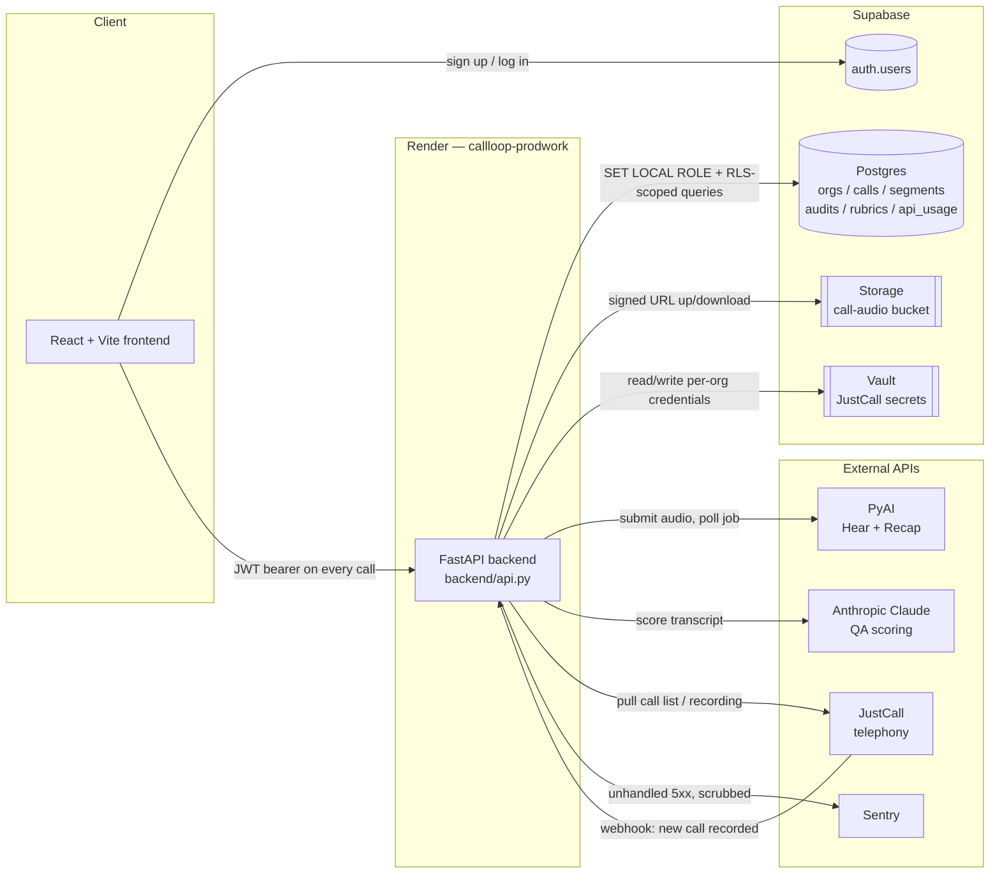

# CallLoop / CallProof — Architecture Reference

> **This is a living document.** Update it whenever a file, table, route, or
> integration is added, renamed, or removed. If you're Cursor (or any engineer)
> picking up work in this repo, read this file first — it exists so you don't
> have to reverse-engineer the codebase from scratch.
>
> Last written: 2026-09-04. Since the last pass: the admin console moved from
> `idb.call-loop.com` to `commandcenter.call-loop.com` — still a
> **shared-build** second origin (same SPA, host-gated UI — not a separate
> admin compile). Also live: a self-serve rubric builder — each org's account
> owner defines their own audit criteria (not just reweighting CallLoop's
> fixed 4 dimensions), separate from Command Center's admin-only reweighting
> tool, which stays as-is. A team can save a **library** of several named
> rubrics and switch which one is active. Sidebar: "Rubric builder", next to
> Audits (`frontend/src/pages/RubricBuilder.tsx`, `backend/rubric_builder.py`,
> `qa_v8.evaluate_custom`). Score persistence: once a call has a completed
> audit, re-scoring it (`?refresh=true`, or a retranscribe) is blocked by
> default — Claude isn't perfectly deterministic, so a re-run could change
> the score. `org_features.enable_call_rescoring` (off by default) lifts
> that per org. Recap and feedback (sentiment-tagged Strength/Improve) now
> render on the per-call Audit Detail page too, not just Agent Pulse.
>
> Also live: admin impersonation — a platform admin can "Log in as" any org
> member from Command Center's Admin page, minting a real Supabase session
> via the Admin API (`backend/impersonation.py`, `POST
> /api/admin/users/{user_id}/impersonate`), logged permanently and
> admin-only in `impersonation_log` (migration `0020`). Smoke-tested
> end-to-end against the real Supabase project — `generate_link`'s response
> nests `hashed_token` top-level, not under `properties` (confirmed, not
> assumed); `/verify` reuses the service-role key rather than needing a
> separate anon key. Jira epic AC-18.
>
> **Built but not yet shipped** (in the working tree, not committed): a
> per-call pipeline audit trail — every stage of upload -> transcribe ->
> score -> serve, including every per-criterion LLM/deterministic dispatch
> and result, and every failure with its cause, as queryable rows rather
> than just log lines (`backend/call_trail.py`, new `call_pipeline_events`
> table, migration `0021`). Viewable in Command Center: Call logs -> a
> call's "View" trail link (`frontend/src/pages/CallTrail.tsx`,
> `GET /api/admin/calls/{call_id}/trail`). "Result displayed" is tracked as
> "the audit API actually served it" (`result_served` stage) — the
> practical, backend-observable proxy; there's no way to know when
> something rendered on a screen. Jira epic: AC-24 (see §4/§6 for the exact
> instrumentation points).

---

## 1. What this product is

**CallLoop** (repo/package name: `callproof`) is a call-QA SaaS product. A
company connects its call recordings (manual upload, or a JustCall telephony
integration), the platform transcribes each call with speaker diarization,
scores it against a configurable rubric using an LLM, and surfaces the score,
transcript, and flagged issues in a dashboard.

**Where it is right now:** early-stage, pre-launch, mid-migration. The
original build was a single-tenant hackathon app (SQLite on local disk, one
shared dataset). It is being rebuilt into a real multi-tenant product on
Supabase (Postgres + Auth + Storage + Vault), with each company isolated into
its own **org** and Postgres Row Level Security enforcing that isolation as a
second layer beneath the application code. The SQLite-era code path has been
fully removed — Postgres is required at runtime, there is no fallback.

**Where it's headed:** domain-based org auto-provisioning at signup (a
company's employees land in the same org automatically), a per-org
rubric-builder UI (the actual product differentiator vs. generic call-scoring
tools), more telephony integrations beyond JustCall, and an admin-facing view
of orgs/users now that real signups exist.

---

## 2. Tech stack

| Layer | Choice | Notes |
|---|---|---|
| Backend framework | **FastAPI** (Python 3.11+) | `backend/api.py` is the whole app |
| ASGI server | **Uvicorn** | `uvicorn backend.api:app` |
| Database | **Supabase Postgres** (managed) | Schema is Alembic-only, no ORM |
| DB driver | **psycopg 3** | `prepare_threshold=0` for PgBouncer/Supabase poolers |
| Migrations | **Alembic** | `alembic/versions/0001` → `0010` so far |
| Auth | **Supabase Auth** | JWT (HS256 or JWKS), verified in `backend/auth.py` |
| Tenant isolation | **Postgres RLS** + app-level `org_id` scoping | Belt and suspenders — see §5 |
| File storage | **Supabase Storage** | Private `call-audio` bucket, signed URLs |
| Secrets vault | **Supabase Vault** | Per-org JustCall credentials, encrypted |
| Error tracking | **Sentry** (`sentry-sdk[fastapi]`) | 5xx only, scrubbed, org-tagged |
| Frontend | **React 19 + TypeScript + Vite** | `frontend/` |
| Frontend auth/data client | `@supabase/supabase-js` | |
| Hosting | **Render** | `callloop-prodwork` (API) + static site `callloop-web` (customer `call-loop.com` and admin `commandcenter.call-loop.com`, AC-12 shared-build) |
| CI | **GitHub Actions** | Real Postgres container; migrate → downgrade → upgrade → pytest |

**External APIs this product depends on:**

| Service | Used for | Where |
|---|---|---|
| **PyAI — Hear** | Transcription + speaker diarization | `backend/transcribe.py` |
| **PyAI — Recap** | Turns a speaker-labelled transcript into a summary | `backend/recap.py` |
| **Anthropic Claude** | Runs the QA rubric against a transcript, produces the score | `backend/qa_engine.py` |
| **JustCall** | Telephony source — pulls call recordings, receives webhooks for new calls | `backend/justcall.py` |
| **Sentry** | Error tracking for 5xx failures | `backend/sentry_report.py` |

---

## 3. High-level architecture



**Request flow in one line:** the frontend never talks to Postgres, Storage,
Vault, PyAI, Claude, or JustCall directly — everything goes through the
FastAPI backend, which resolves the caller's `org_id` from their JWT on every
request and scopes every downstream call to that org.

---

## 4. Repo layout — what each file is for

### Root

| File | Purpose |
|---|---|
| `api.py`, `qa_engine.py`, `transcribe.py` | **Compatibility shims only** (1–6 lines each) — re-export from `backend.*` so old commands (`uvicorn api:app`) still work. The real code is in `backend/`. Don't add logic here. |
| `test_claude.py` | Standalone manual smoke test for Anthropic connectivity — `python test_claude.py`. Not part of the pytest suite. |
| `rubric.json` | The runtime scoring rubric (legacy v8 shape), seeded into every new org's `rubrics` table. |
| `requirements.txt` | Backend Python dependencies. |
| `render.yaml` | Render Blueprint — recreates the `callloop-prodwork` service exactly (env vars, build/start commands, no persistent disk). **Start Command** runs `alembic upgrade head` then uvicorn (free plan never runs Pre-Deploy). |
| `pytest.ini` | Pytest configuration. |
| `.env.example` | Documents every required env var name with no real values. Copy to `.env` (gitignored) locally. |
| `README.md` | Setup/install/deploy instructions — the "how do I run this" doc. |
| `ARCHITECTURE.md` | This file — the "what is this and how does it fit together" doc. |
| `docs/postgres-cutover.md` | Rollback runbook for the Postgres-only cutover (app rollback vs. data rollback vs. schema rollback). |
| `docs/adr/001-tenancy-model.md` | Why shared-schema + RLS was chosen over schema/DB-per-tenant, the `org_members` RLS exception, domain-matching signup, and `DEFAULT_ORG_ID`'s actual remaining purpose. |

### `backend/` — the FastAPI app

| File | Purpose |
|---|---|
| `__init__.py` | Loads the repo-root `.env` before any sibling module reads `os.getenv`. |
| `api.py` | **The whole app.** Every HTTP route lives here (see §6 for the route table). |
| `config.py` | Env loading, CORS origins, `skip_startup()` (test/CI flag to import the app without provider bootstrap). |
| `paths.py` | Repo-root-relative paths (log dir, rubric path, `.env` path) — independent of process cwd. |
| `auth.py` | Verifies Supabase JWTs, `ensure_membership()`, `ensure_placeholder_org()` — idempotent seed of `DEFAULT_ORG_ID` for webhook/CLI/usage fallbacks only (not signup) — `require_platform_admin()`, the internal admin-console gate, and `require_owner()`, the self-serve rubric builder's gate (see §5). |
| `admin_provision.py` | AC-3/AC-6/AC-7: creates a Supabase Auth user (generated password, `email_confirm: true`) plus an `org_members` row. `org_mode="new"` resolves a final org name (admin-given or auto-derived), looks it up via `org_id_for_name()` — a match joins that org as `member`; no match creates a new org as `owner`. `org_mode="existing"` targets an org id directly, unaffected by name matching. Rolls back the auth user if the org/membership insert fails. Response includes `created: bool` so the caller knows which happened. Callers must already have passed `require_platform_admin`; the module itself doesn't re-check. Password is returned once, never logged (enforced by a static test). |
| `org_features.py` | AC-4/AC-5: `features_for_org()` (read, org-scoped, defaults missing keys to enabled) and `set_feature()` (upsert, admin-gated caller). `FEATURE_KEYS` is the trial-run flag list — add a key here without a migration. `enable_call_rescoring` (off by default) gates whether an already-audited call can ever be re-scored — see `api._load_or_compute_audit`. |
| `admin_console.py` | AC-5: directory search (via the `admin_search_directory` SQL function, never `org_directory` directly), org usage/cost lookup (`org_scope()` redirects `pyai_usage.usage_summary()`'s ambient RLS scoping to the *queried* org), and the feature-write entrypoint the admin panel calls. |
| `org_ids.py` | Tenant-id plumbing: `contextvars`-based `bind_org_id`/`bound_org_id`/`org_scope`, `DEFAULT_ORG_ID`/`DEFAULT_RUBRIC_ID` constants (still used by background/webhook fallback paths, **not** by human signup anymore). |
| `db.py` | Opens Postgres connections, runs `SET LOCAL ROLE callproof_app` + sets the tenant GUCs (`app.current_org_id`, `app.current_user_id`) so RLS applies. `bypass_rls=True` is a narrowly-scoped escape hatch for specific admin/background paths only — see the comment in that file before ever reaching for it. |
| `db_url.py` | Reads and normalizes `DATABASE_URL`/`SUPABASE_DB_URL`. Never logs it (embeds a password). |
| `audit_store.py` | Reads/writes `audits` and `rubrics` rows; seeds the legacy rubric for new orgs. `insert_weighted_version()` (CR-13, Command Center reweighting) and `insert_custom_definition()` (self-serve builder, arbitrary dimension set) are separate functions on purpose — same versioning discipline, kept apart so the admin-only tool stays untouched by the self-serve one. |
| `rubric_builder.py` | Self-serve rubric builder (customer-facing, gated by `auth.require_owner`, not admin): a team's own mix of built-in dimensions (reused unchanged from `rubric.json` unless the team edits their criteria text, which converts that one to a custom dimension — a built-in's deterministic logic isn't rewritable by text) and free-text custom ones (`method: "custom_llm"`, Claude-judged). A **multi-rubric library**: teams save several independently-versioned named rubrics (`audit_store.save_named_rubric`/`list_rubric_lineages`/`activate_rubric_by_name`), at most one active org-wide at a time — same `rubrics` schema, no migration. Deliberately separate from `admin_console.py`. |
| `audio_store.py` | Uploads/downloads call recordings to/from the private Supabase Storage bucket; issues signed URLs. |
| `audio_backfill.py` | One-off CLI (`python -m backend.audio_backfill`) to push any leftover local recordings into Storage. |
| `org_vault.py` | Per-org JustCall credentials in Supabase Vault — `put_justcall`/`load_justcall`/`delete_justcall`. Plaintext keys never touch a table; only a key suffix is indexed in `org_credentials`. |
| `env_keys.py` | Validates allowlisted API-key formats. Never logs secret values. |
| `justcall.py` | JustCall REST client — pagination (0-indexed), call list, recording download, webhook signature verification. |
| `transcribe.py` | Submits audio to PyAI Hear, polls until done, picks channel-split vs. diarize mode, persists the transcript. |
| `recap.py` | PyAI Recap client — turns a speaker-labelled transcript into a summary. |
| `qa_engine.py` | Runs the rubric against a transcript via Claude, produces a deterministic score. Shared with the ticket engine only via `build_prompt` / `call_claude` / `validate_evidence` — ticket scoring must not grow any other import from this file. |
| `rules.py`, `rules_v8.py`, `qa_v8.py` | Deterministic rule/rubric implementations the QA engine calls into (v8 is the current rubric shape). `qa_v8.evaluate_dimension()`'s dispatch is by dimension `id` for the 4 built-ins, falling through to a generic `method: "custom_llm"` branch (`evaluate_custom()`) for a self-serve team's own free-text criteria — reuses the exact `build_prompt`/`call_claude`/`validate_evidence` pipeline the built-ins use, no bespoke prompt per criterion. `run_v8_wave()` already scales its worker pool to however many dimensions the rubric has — no changes needed there for an arbitrary dimension count. Ticket auditing does not import these files. |
| `ticket_pdf_parser.py` | TA-4/TA-5. Deterministic JustCall PDF-export parser. `parse_ticket_pdf()` → ordered `{seq, speaker, agent_user_id, text}` turns (no Claude, no `transcribe.py`). `parse_turns_with_pages()` additionally tags each turn with the page it started on, so `ticket_ingest.py` can place an embedded image at the right point in the sequence instead of only at the end. |
| `ticket_image_extraction.py` | TA-5. `extract_images()` pulls embedded raster objects out of a PDF (pypdfium2); `describe_image()` is one Claude vision call per image. Standalone — no import from the call-scoring engine. Real JustCall exports currently yield no image XObjects (screenshots flatten to a literal `[Image]` text token on export), so this only fires for a source that actually embeds real image data; validated live against a synthetic PDF + the real Anthropic API. |
| `ticket_image_store.py` | TA-5. Private per-org Storage for ticket screenshots (`ticket-images` bucket), same shape as `audio_store.py` for call audio — signed URLs only, never a public read policy. |
| `ticket_ingest.py` | TA-4/TA-5 write path. `ingest_ticket_pdf()`: parses text turns + embedded images, `interleave_images()` merges an image into the turn sequence right after the last text turn on the same PDF page (inheriting that turn's speaker — the closest signal available without exact on-page coordinates), writes everything to `ticket_messages`, stores each image via `ticket_image_store` + a `ticket_message_assets` row. Any failure anywhere in the pipeline marks the ticket `failed` and re-raises — nothing partial is left looking like a successful ingest. Scoring (TA-6) needs zero changes: an image-derived turn is just a normal turn in the sequence. Also the org-scoped reads behind `/api/tickets` (`list_tickets` / `get_ticket`). |
| `ticket_api.py` | TA-9. `/api/tickets` HTTP surface. `POST /api/tickets/upload` accepts a PDF and hands it to `ingest_ticket_pdf` — not `/api/upload`. JWT org_id only. |
| `ticket_scoring.py` | TA-6. Ticket engine's own evaluation loop (`run_ticket_wave` / `score_ticket`). Imports only `build_prompt`, `call_claude`, `validate_evidence` from `qa_engine.py`. v1 scores the whole thread once; `agent_spans` / `primary_owner` / evidence-seq attribution are the TA-8 multi-agent data, not per-span re-scoring. |
| `ticket_score_api.py` | TA-10/TA-11. `POST /api/tickets/{ticket_id}/score`. First score persists to `ticket_audits`; a later POST returns the stored scorecard. `?refresh=true` is 403 unless `enable_ticket_rescoring` is on (off by default). |
| `ticket_audit_store.py` | TA-11. Org-scoped read/upsert for `ticket_audits`. Not `audit_store.py` (that is calls). |
| `pyai_usage.py` | Local counters for outbound PyAI/Claude API calls (PyAI has no "requests used today" endpoint of its own). |
| `cost_estimate.py` | Estimates spend from usage counters, using cost-per-unit knobs from `.env`. |
| `email_notify.py` | Opens a prefilled Gmail compose tab for a churn/stakeholder alert — no email is sent server-side. |
| `error_notify.py` | Local desktop error notification helper (macOS banner on API 5xx during dev). |
| `impersonation.py` | AC-18. Platform-admin "log in as": mints a real Supabase session for an org member via the Admin REST API (`generate_link` + `verify`, raw `httpx`, matching `admin_provision.py`'s pattern — not the `supabase-py` SDK), records one permanent `impersonation_log` row only after both Supabase calls succeed. Admin-only, no live consent step — the log is the accountability mechanism, not a gate. |
| `call_trail.py` | AC-24/AC-26, **built, not yet shipped.** `record(call_id, org_id, stage, status, *, detail=None, error=None)` — best-effort append to `call_pipeline_events` (never raises; a trail-write failure must not break the pipeline step it describes). Called alongside the existing `applog.event()` calls at each real stage — upload/transcription, per-criterion scoring (via `qa_v8.run_v8_wave`'s injected `on_dimension_event` callback), recap, final audit result, and every `result_served`. `history(call_id, org_id)` reads it back in order for the admin trail viewer. |
| `sentry_report.py` | Sentry init + `before_send` scrubbing hook — drops 4xx, strips PII/secrets, tags `org_id`. |
| `applog.py` | Structured event logging (`applog.event(...)`) plus secret redaction for anything written to the log file. |

### `alembic/` — schema history (the source of truth for the DB)

Schema changes only ever happen here — never as ad-hoc SQL in `backend/`.

| Revision | What it did |
|---|---|
| `0001_orgs_calls_segments_audits` | `orgs` + `calls`/`segments`/`audits` with `org_id NOT NULL` on every table from the start. Seeds a placeholder `orgs` row (`DEFAULT_ORG_ID`, name `"default"`) still used by non-signup fallback paths. |
| `0002_api_usage` | `api_usage` table, org-scoped. |
| `0003_rubrics_audits` | Drops and recreates `audits` with a surrogate UUID PK to support multiple rubrics per org; adds `rubrics`. |
| `0004_org_members` | `org_members` — maps a Supabase `auth.users.id` to an `org_id` + role. Auth-only, not used for query scoping. |
| `0005_rls` | Enables RLS + CRUD policies on every tenant table, creates the `callproof_app` role (`NOLOGIN NOSUPERUSER NOBYPASSRLS`). |
| `0006_rls_role_grant` | Grants `callproof_app` to the DB login so `SET ROLE` actually works. |
| `0007_org_members_no_rls` | Explicitly disables RLS on `org_members` — a brand-new signup can't have an org GUC yet, so RLS on this one table would deadlock its own bootstrap. |
| `0008_storage_audio_bucket` | Creates the private `call-audio` Storage bucket (no-ops gracefully on plain Postgres without Supabase's `storage` schema). |
| `0009_org_vault_justcall` | `org_credentials` index table (org_id, provider, key suffix only) — the actual secrets live in Supabase Vault. |
| `0010_orgs_domain_column` | `orgs.domain` (nullable, unique) + a `SECURITY DEFINER` SQL function `org_id_for_domain()` used to resolve a same-company signup race without opening an RLS-bypassing connection from application code. |
| `0011_org_members_names_and_directory_view` | `org_members.first_name` / `last_name` (nullable, no backfill). `org_directory` view (email + names + org) is **admin SQL only** — not granted to `callproof_app`, not served by the API. |
| `0012_org_members_short_id` | `org_members.short_id` unique integer from sequence starting at 100000 (`DEFAULT nextval`). **GRANT USAGE, SELECT** on the sequence to `callproof_app` is required for inserts. `org_directory` also selects `short_id`. |
| `0013_org_features` | `org_features` table (AC-4) — per-org flag overrides, missing rows default to enabled. Also adds `org_members.first_seen` / `last_sign_in` for the admin directory. |
| `0014_org_features_write` | Write-side policies for `org_features` (AC-5) plus the `admin_search_directory` `SECURITY DEFINER` SQL function the admin panel's directory search goes through instead of selecting `org_directory` directly. |
| `0015_org_id_for_name` | `org_id_for_name()` `SECURITY DEFINER` function (AC-7) — lets admin provisioning join an existing same-name org instead of creating a duplicate, without an RLS-bypassing connection. |
| `0022_tickets` | `tickets` + `ticket_messages` (TA-3). Ticket auditing is a separate engine from calls. `tickets` is mutable (`status`); `ticket_messages` is append-only. `agent_user_id` nullable FK to `org_members(user_id)` for TA-8. RLS in this revision. |
| `0023_ticket_image_assets` | Private `ticket-images` Storage bucket (no-ops on plain Postgres, same pattern as `0008_storage_audio_bucket`) + `ticket_message_assets` (TA-5) — metadata only, no image bytes in Postgres. FK'd on `(ticket_id, seq)` rather than `ticket_messages.id`, so the insert doesn't need to round-trip a returned id. Append-only, RLS in this revision. |
| `0024_ticket_audits` | `ticket_audits` (TA-11). One stored scorecard per ticket. RLS SELECT/INSERT/UPDATE. Makes the rescoring guard enforceable. |

### `frontend/src/`

| Folder | Purpose |
|---|---|
| `pages/` | One file per route/screen: `Login.tsx` (also handles "Forgot password?", CL-29), `ResetPassword.tsx` (the set-new-password landing page a reset email links to, CL-29 — gated on Supabase's `PASSWORD_RECOVERY` auth event, not just the URL having a token), `Home.tsx`, `FlaggedForReview.tsx`, `ChurnRisk.tsx`, `Training.tsx`, `Integrations.tsx`, `AgentsPulse.tsx`, `Feedbacks.tsx`, `Neighbourhood.tsx`, `Pyai.tsx`, `Admin.tsx` (platform-admin only — directory search, usage/cost, flag toggles, and the "Provision user" form; redirects everyone else to `/`, real enforcement is server-side). |
| `components/` | Reusable UI pieces — call playback (`TranscriptPlayer`, `CallWaveform`), layout (`AppLayout`, `Sidebar`), status widgets (`UsageMeter`, `PyaiBadge`, `LiveTicker`), the JustCall keys form (`KeysPanel`). `Sidebar`/`UsageMeter`/`PyaiBadge` all read `AuthContext`'s `features` map to hide themselves per-org; `Sidebar` also renders the caller's own org name under the tagline (CL-31). |
| `context/` | React context providers: `AuthContext` (Supabase session, plus `/api/me`'s `features`, `isPlatformAdmin`, and `orgName`), `AuditContext`, `PyaiStatus`, `ColorMode`, `UsageEnv`. |
| `lib/` | `supabase.ts` (client init), `api.ts` (backend fetch wrapper), `mapAudit.ts`, `format.ts`, `zipAudio.ts`, `speakerText.ts`, `features.ts` (`flagEnabled()` — missing key defaults to shown — and `TRIAL_FLAGS`; deliberately holds no admin-email list, that lives server-side only). |

---

## 5. Auth & multi-tenancy — how a request gets isolated

```mermaid
sequenceDiagram
    participant U as User's browser
    participant SB as Supabase Auth
    participant API as FastAPI (backend/auth.py)
    participant PG as Postgres

    U->>SB: sign up / log in (email, password)
    SB-->>U: JWT access token (sub, email, user_metadata)
    U->>API: any request, Authorization: Bearer <JWT>
    API->>API: verify_access_token() — signature, issuer, audience, exp
    API->>PG: ensure_membership(sub, email) — SELECT org_members WHERE user_id
    alt already a member
        PG-->>API: existing org_id + role
    else brand-new signup
        API->>API: derive email domain
        alt public provider (gmail, outlook, ...)
            API->>PG: create a new personal org
        else company domain
            API->>PG: INSERT org ... ON CONFLICT (domain) DO NOTHING
            Note over API,PG: loser of the race calls org_id_for_domain()<br/>to join the winner's org — no RLS bypass
        end
    end
    API->>PG: SET LOCAL ROLE callproof_app; SET app.current_org_id = <org_id>
    API->>PG: every subsequent query in this request is RLS-scoped to that org_id
    API-->>U: response, scoped to the caller's org only
```

**Two independent layers of isolation, on purpose:**
1. **App layer** — `org_id` is read exclusively from the verified JWT/membership lookup (`backend/org_ids.py`), never from a query param, path segment, or JSON body a client could forge.
2. **DB layer** — Postgres RLS policies re-check `org_id = current_org_id()` on every query, using a role (`callproof_app`) that cannot bypass RLS even if the app layer had a bug. This is defense-in-depth: either layer alone being wrong doesn't leak data across orgs.

**`org_members` is the one deliberate exception** — it has RLS disabled (migration `0007`). A brand-new signup has no `org_id` yet, so RLS on the very table that assigns one would be a chicken-and-egg deadlock. Isolation for this table comes entirely from the app layer (`ensure_membership()` only ever looks up by the verified `user_id` from the JWT).

**Signup → org assignment (current behavior, as of Ticket 1):**
- Same company domain (not a public email provider) → first signup creates the org, everyone else from that domain joins it automatically.
- Public providers (gmail.com, outlook.com, yahoo.com, etc.) → always get their own new org. This is deliberate — auto-matching on a shared public domain would put unrelated strangers in the same tenant.
- `DEFAULT_ORG_ID` (the seeded `"default"` org) is **never** assigned to a human signup anymore — it still exists for non-signup fallback paths (JustCall webhook host-fallback, background QA/usage jobs with no bound org).

**Platform-admin access is a separate, orthogonal mechanism — not a third tenant-isolation layer.** `require_platform_admin()` (`backend/auth.py`) checks the verified JWT's email against a `PLATFORM_ADMIN_EMAILS` allowlist (comma-separated env var, empty means nobody — fails closed). It has nothing to do with `org_id`, RLS, or `org_members`: being a platform admin doesn't grant cross-org data access by itself, and it's deliberately not modeled as membership in an "Admins" org, since `org_members` only allows one org per user (`UNIQUE (user_id)`) and that would collide with an admin also having their own regular account. Every `/api/admin/*` route (Admin Controls epic, `AC-` in Jira) calls this first, same inline-helper convention as `_org(request)` on regular routes.

**AC-12 hosting decision (explicit):** the internal console lives at `https://commandcenter.call-loop.com` as the **same frontend build** with a second custom domain, not a separate deployed admin app. Hostname switches routing/chrome; API auth is unchanged (`require_platform_admin`). CORS allowlists that origin (`backend.config.ADMIN_ORIGIN`); wildcards are rejected. This is not a hardened origin boundary — customer JS still contains the Admin page.

**`require_owner()`** (`backend/auth.py`) is the equivalent gate for the self-serve rubric builder — checks `request.state.role == "owner"` (set on every request from `org_members.role`). `org_members.role` is only `"owner"` or `"member"` today (see `docs/adr/001-tenancy-model.md` / the roles hierarchy note); there's no team-admin tier yet, so this starts owner-only and will need revisiting once that role ships.

---

## 6. Internal API surface (`backend/api.py`)

| Method | Path | Purpose |
|---|---|---|
| GET | `/health`, `/healthz` | Liveness for hosts (Render) — no downstream calls |
| GET | `/` | Health check |
| GET | `/api/me` | Current user/org/role/features, plus `org_name` (CL-31) resolved from `orgs.name` for the caller's own org — RLS-scoped, never another org's |
| GET | `/api/rubric` | Self-serve rubric builder: the caller's org's active rubric (built-in + custom dimension mix). Any authenticated org member. |
| POST | `/api/rubric` | Self-serve rubric builder: save a new rubric version under whatever name is currently active (or the legacy default name on a first save) — any mix of built-in/custom dimensions, weights sum to 100. **Owner-only** (`require_owner`), separate gate from `require_platform_admin`. |
| GET | `/api/rubrics` | Self-serve rubric builder: the library — every named rubric this org has saved, latest version + active flag each. |
| GET | `/api/rubrics/{name}` | Self-serve rubric builder: one named rubric's latest version, for loading into the editor. |
| POST | `/api/rubrics/{name}` | Self-serve rubric builder: save a new version under this specific name (a library entry, `activate: bool` in the body controls whether it also becomes the org's active rubric). **Owner-only.** |
| POST | `/api/rubrics/{name}/activate` | Self-serve rubric builder: switch which saved rubric is active — no dimension change, just a swap. **Owner-only.** |
| POST | `/api/admin/provision-user` | **Platform-admin only.** Create a login + org membership for a personal-email (Gmail, etc.) signup, org named by the admin; returns a one-time generated password. Gated by `require_platform_admin` — 403 for everyone else, checked before any Supabase call. |
| GET | `/api/admin/directory` | **Platform-admin only.** Search `org_directory` (email/name/org id/user id/short id substring) via the `admin_search_directory` SQL function — `org_directory` itself is never granted to the app role. |
| GET | `/api/admin/usage` | **Platform-admin only.** All-time PyAI/Anthropic call, poll, and estimated-cost totals for one *queried* org — not the caller's own. |
| POST | `/api/admin/features` | **Platform-admin only.** Upsert one `org_features` row for a target org. |
| GET | `/api/admin/activity` | **Platform-admin only.** Date + org/short_id activity from `calls` / `audits` / `org_features_history` (not app logs). |
| GET | `/api/admin/orgs/{org_id}/rubric` | **Platform-admin only.** Current dimension weights for an org (CR-14). |
| POST | `/api/admin/orgs/{org_id}/rubric` | **Platform-admin only.** Insert a new weighted rubric version (CR-13). Weights must sum to 100; never mutates an existing row. |
| POST | `/api/admin/log-password-reset-request` | **Platform-admin only.** (AC-9) Writes an audit log line for an admin-triggered reset email — never logs the password, never calls Supabase's admin/service-role API itself. |
| POST | `/api/admin/users/{user_id}/impersonate` | **Platform-admin only.** (AC-18.) Mints a real Supabase session for this org member via the Admin API and returns the tokens; records one permanent `impersonation_log` row. No live consent step — admin-only, logged. |
| GET | `/api/admin/calls/{call_id}/trail?org_id=` | **Platform-admin only.** (AC-24/AC-27, built, not yet shipped.) Full pipeline audit trail for one call. `org_id` is a required, caller-supplied query param (Call Logs already has it per row) — this route must never `bypass_rls` (repo-wide guardrail in `test_rls.py`); every query is scoped through `org_scope(org_id)`. |
| GET | `/api/pyai/status` | PyAI connectivity/quota status |
| POST | `/api/keys` | Update host-configured API keys |
| GET | `/api/dev/logs` | Tail recent log lines (dev/debug) |
| GET | `/api/calls` | List calls for the caller's org |
| POST | `/api/cache/clear` | Clear server-side cache |
| GET | `/api/calls/flagged` | Calls flagged for review |
| GET | `/api/calls/export-scorecard` | Export scorecards |
| GET | `/api/calls/export` | Export calls (CSV) |
| GET | `/api/calls/{call_id}/audit` | Get (or recompute) a call's QA audit |
| POST | `/api/calls/{call_id}/flag` | Flag a call for review |
| POST | `/api/calls/{call_id}/solve` | Resolve a flagged review |
| POST | `/api/calls/{call_id}/feedback` | Post feedback on a call |
| GET | `/api/calls/{call_id}/stakeholder-email/compose` | Prefilled churn-alert email link |
| GET/POST/DELETE | `/api/integrations/justcall` | JustCall credential status / save / delete |
| POST | `/api/integrations/justcall/sync` | Manually trigger a JustCall pull |
| POST | `/api/integrations/justcall/webhook` | JustCall's inbound webhook (new call recorded) — public, signature-verified |
| GET | `/api/calls/{call_id}/audio` | Signed URL to play back a recording |
| POST | `/api/calls/{call_id}/retranscribe` | Re-run Hear on a stored recording |
| POST | `/api/upload` | Upload a single audio file for transcription + scoring |
| POST | `/api/upload-batch` | Upload a zip of audio files, processed in parallel |
| POST | `/api/tickets/upload` | Upload a JustCall ticket PDF. Hands off to TA-4 ingest + TA-5 screenshot extraction. Separate from `/api/upload`. |
| GET | `/api/tickets` | List tickets for the caller's org |
| GET | `/api/tickets/{ticket_id}` | One ticket, sequenced turns, screenshot metadata |
| GET | `/api/tickets/{ticket_id}/assets/{seq}` | Signed URL for one stored ticket screenshot |
| POST | `/api/tickets/{ticket_id}/score` | Score a ticket (TA-10/11). First call persists; later calls return the stored scorecard. `?refresh=true` is 403 unless `enable_ticket_rescoring` is on. |

Every route except the JustCall webhook requires a valid Supabase JWT; the webhook authenticates via JustCall's own signature header instead. `/api/admin/*` routes require a valid JWT *and* pass `require_platform_admin` on top — a normal authenticated user gets 403, not tenant-scoped data.

---

## 7. Current known gaps (keep this section honest, don't let it go stale)

- Admin Controls epic (AC-2 through AC-7) is fully live: authorization gate, manual provisioning (admin-chosen org name, same-name orgs merge rather than duplicate), per-org feature flags, and the admin panel UI itself. `short_id` is sequential (100000+) by design, not random.
- Org-name matching for provisioning (`org_id_for_name()`) is exact, case-insensitive, and trimmed — not fuzzy. "Acme Inc" and "Acme Inc." are different orgs on purpose; there's no UI yet to merge two orgs that were already accidentally split by a naming mismatch (would need a manual `UPDATE org_members SET org_id = ...` today, plus manual DELETEs of the now-empty old org's rows — done by hand at least once already). **CL-30** (add `orgs.created_via` so this class of duplicate is visible from the data instead of reconstructed from timestamps) is still backlog. **AC-10** (feature-flag change history) is shipped (`org_features_history`, Alembic `0016`).
- `admin_console.py`'s `search_directory()` swallows any lookup failure silently (`except Exception: return {"rows": []}`, no log line) — same class of gap `org_features.py`'s `features_for_org()` had before it got a `log.debug` line. Worth the same fix; low priority since it only affects the admin's own view, not tenant data.
- A second platform admin is added by editing `PLATFORM_ADMIN_EMAILS` on Render — there's no self-service "add another admin" UI, and that's deliberate for now (see §5's note on why this isn't modeled as an "Admins" org).
- `applog.py`'s secret-redaction filter is attached to the file log handler only — console/stdout output is not covered by the same filter.

---

*Keep this file in sync with the code. When you add a table, route, or
integration, add a row here in the same PR — don't let this drift into
fiction.*
