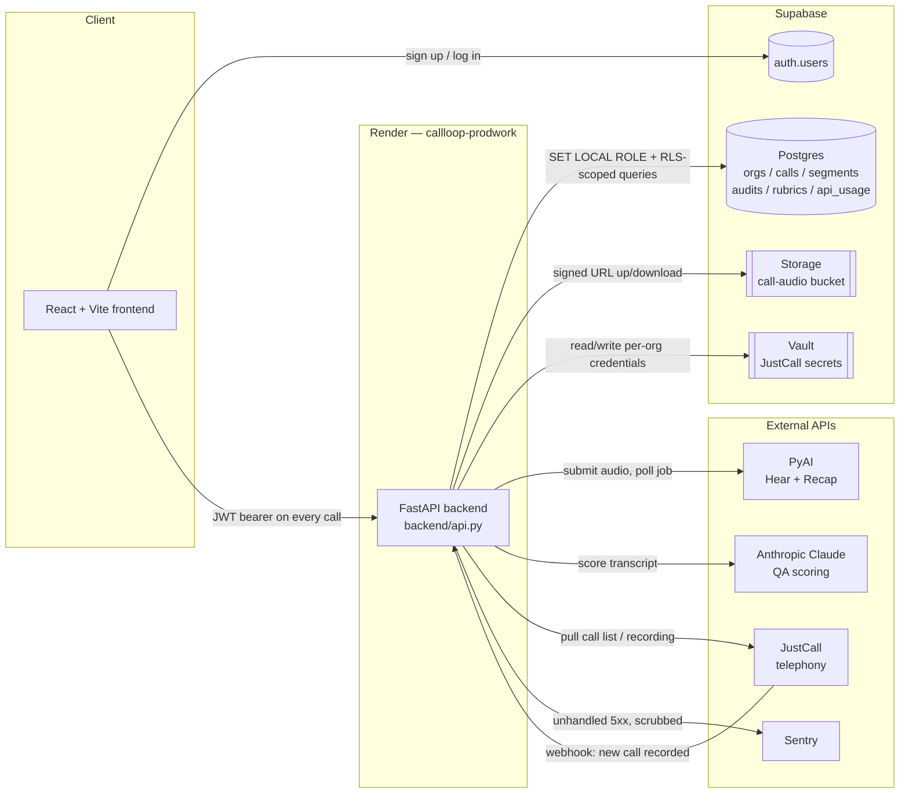

# CallLoop / CallProof — Architecture Reference

> **This is a living document.** Update it whenever a file, table, route, or
> integration is added, renamed, or removed. If you're Cursor (or any engineer)
> picking up work in this repo, read this file first — it exists so you don't
> have to reverse-engineer the codebase from scratch.
>
> Last written: 2026-08-27, reflecting the repo through signup first/last name
> (`org_members` + admin-only `org_directory`; Ticket 2 of the tenancy epic).

---

## 1. What this product is

**CallLoop** (repo/package name: `callproof`) is a call-QA SaaS product. A
company connects its call recordings (manual upload, or a JustCall telephony
integration), the platform transcribes each call with speaker diarization,
scores it against a configurable rubric using an LLM, and surfaces the score,
transcript, and flagged issues in a dashboard.

**Where it is right now:** early-stage, pre-launch, mid-migration. The
original build was a single-tenant hackathon app (SQLite on local disk, one
shared dataset). It is being rebuilt into a real multi-tenant product on
Supabase (Postgres + Auth + Storage + Vault), with each company isolated into
its own **org** and Postgres Row Level Security enforcing that isolation as a
second layer beneath the application code. The SQLite-era code path has been
fully removed — Postgres is required at runtime, there is no fallback.

**Where it's headed:** domain-based org auto-provisioning at signup (a
company's employees land in the same org automatically), a per-org
rubric-builder UI (the actual product differentiator vs. generic call-scoring
tools), more telephony integrations beyond JustCall, and an admin-facing view
of orgs/users now that real signups exist.

---

## 2. Tech stack

| Layer | Choice | Notes |
|---|---|---|
| Backend framework | **FastAPI** (Python 3.11+) | `backend/api.py` is the whole app |
| ASGI server | **Uvicorn** | `uvicorn backend.api:app` |
| Database | **Supabase Postgres** (managed) | Schema is Alembic-only, no ORM |
| DB driver | **psycopg 3** | `prepare_threshold=0` for PgBouncer/Supabase poolers |
| Migrations | **Alembic** | `alembic/versions/0001` → `0010` so far |
| Auth | **Supabase Auth** | JWT (HS256 or JWKS), verified in `backend/auth.py` |
| Tenant isolation | **Postgres RLS** + app-level `org_id` scoping | Belt and suspenders — see §5 |
| File storage | **Supabase Storage** | Private `call-audio` bucket, signed URLs |
| Secrets vault | **Supabase Vault** | Per-org JustCall credentials, encrypted |
| Error tracking | **Sentry** (`sentry-sdk[fastapi]`) | 5xx only, scrubbed, org-tagged |
| Frontend | **React 19 + TypeScript + Vite** | `frontend/` |
| Frontend auth/data client | `@supabase/supabase-js` | |
| Hosting | **Render** | `callloop-prodwork` (API) + a static site (frontend) |
| CI | **GitHub Actions** | Real Postgres container; migrate → downgrade → upgrade → pytest |

**External APIs this product depends on:**

| Service | Used for | Where |
|---|---|---|
| **PyAI — Hear** | Transcription + speaker diarization | `backend/transcribe.py` |
| **PyAI — Recap** | Turns a speaker-labelled transcript into a summary | `backend/recap.py` |
| **Anthropic Claude** | Runs the QA rubric against a transcript, produces the score | `backend/qa_engine.py` |
| **JustCall** | Telephony source — pulls call recordings, receives webhooks for new calls | `backend/justcall.py` |
| **Sentry** | Error tracking for 5xx failures | `backend/sentry_report.py` |

---

## 3. High-level architecture



**Request flow in one line:** the frontend never talks to Postgres, Storage,
Vault, PyAI, Claude, or JustCall directly — everything goes through the
FastAPI backend, which resolves the caller's `org_id` from their JWT on every
request and scopes every downstream call to that org.

---

## 4. Repo layout — what each file is for

### Root

| File | Purpose |
|---|---|
| `api.py`, `qa_engine.py`, `transcribe.py` | **Compatibility shims only** (1–6 lines each) — re-export from `backend.*` so old commands (`uvicorn api:app`) still work. The real code is in `backend/`. Don't add logic here. |
| `test_claude.py` | Standalone manual smoke test for Anthropic connectivity — `python test_claude.py`. Not part of the pytest suite. |
| `rubric.json` | The runtime scoring rubric (legacy v8 shape), seeded into every new org's `rubrics` table. |
| `requirements.txt` | Backend Python dependencies. |
| `render.yaml` | Render Blueprint — recreates the `callloop-prodwork` service exactly (env vars, build/start commands, no persistent disk). |
| `pytest.ini` | Pytest configuration. |
| `.env.example` | Documents every required env var name with no real values. Copy to `.env` (gitignored) locally. |
| `README.md` | Setup/install/deploy instructions — the "how do I run this" doc. |
| `ARCHITECTURE.md` | This file — the "what is this and how does it fit together" doc. |
| `docs/postgres-cutover.md` | Rollback runbook for the Postgres-only cutover (app rollback vs. data rollback vs. schema rollback). |

### `backend/` — the FastAPI app

| File | Purpose |
|---|---|
| `__init__.py` | Loads the repo-root `.env` before any sibling module reads `os.getenv`. |
| `api.py` | **The whole app.** Every HTTP route lives here (see §6 for the route table). |
| `config.py` | Env loading, CORS origins, `skip_startup()` (test/CI flag to import the app without provider bootstrap). |
| `paths.py` | Repo-root-relative paths (log dir, rubric path, `.env` path) — independent of process cwd. |
| `auth.py` | Verifies Supabase JWTs, and `ensure_membership()` — the org-bootstrap logic that decides which org a signed-up user lands in (see §5). |
| `org_ids.py` | Tenant-id plumbing: `contextvars`-based `bind_org_id`/`bound_org_id`/`org_scope`, `DEFAULT_ORG_ID`/`DEFAULT_RUBRIC_ID` constants (still used by background/webhook fallback paths, **not** by human signup anymore). |
| `db.py` | Opens Postgres connections, runs `SET LOCAL ROLE callproof_app` + sets the tenant GUCs (`app.current_org_id`, `app.current_user_id`) so RLS applies. `bypass_rls=True` is a narrowly-scoped escape hatch for specific admin/background paths only — see the comment in that file before ever reaching for it. |
| `db_url.py` | Reads and normalizes `DATABASE_URL`/`SUPABASE_DB_URL`. Never logs it (embeds a password). |
| `audit_store.py` | Reads/writes `audits` and `rubrics` rows; seeds the legacy rubric for new orgs. |
| `audio_store.py` | Uploads/downloads call recordings to/from the private Supabase Storage bucket; issues signed URLs. |
| `audio_backfill.py` | One-off CLI (`python -m backend.audio_backfill`) to push any leftover local recordings into Storage. |
| `org_vault.py` | Per-org JustCall credentials in Supabase Vault — `put_justcall`/`load_justcall`/`delete_justcall`. Plaintext keys never touch a table; only a key suffix is indexed in `org_credentials`. |
| `env_keys.py` | Validates allowlisted API-key formats. Never logs secret values. |
| `justcall.py` | JustCall REST client — pagination (0-indexed), call list, recording download, webhook signature verification. |
| `transcribe.py` | Submits audio to PyAI Hear, polls until done, picks channel-split vs. diarize mode, persists the transcript. |
| `recap.py` | PyAI Recap client — turns a speaker-labelled transcript into a summary. |
| `qa_engine.py` | Runs the rubric against a transcript via Claude, produces a deterministic score. |
| `rules.py`, `rules_v8.py`, `qa_v8.py` | Deterministic rule/rubric implementations the QA engine calls into (v8 is the current rubric shape). |
| `pyai_usage.py` | Local counters for outbound PyAI/Claude API calls (PyAI has no "requests used today" endpoint of its own). |
| `cost_estimate.py` | Estimates spend from usage counters, using cost-per-unit knobs from `.env`. |
| `email_notify.py` | Opens a prefilled Gmail compose tab for a churn/stakeholder alert — no email is sent server-side. |
| `error_notify.py` | Local desktop error notification helper (macOS banner on API 5xx during dev). |
| `sentry_report.py` | Sentry init + `before_send` scrubbing hook — drops 4xx, strips PII/secrets, tags `org_id`. |
| `applog.py` | Structured event logging (`applog.event(...)`) plus secret redaction for anything written to the log file. |

### `alembic/` — schema history (the source of truth for the DB)

Schema changes only ever happen here — never as ad-hoc SQL in `backend/`.

| Revision | What it did |
|---|---|
| `0001_orgs_calls_segments_audits` | `orgs` + `calls`/`segments`/`audits` with `org_id NOT NULL` on every table from the start. Seeds a placeholder `orgs` row (`DEFAULT_ORG_ID`, name `"default"`) still used by non-signup fallback paths. |
| `0002_api_usage` | `api_usage` table, org-scoped. |
| `0003_rubrics_audits` | Drops and recreates `audits` with a surrogate UUID PK to support multiple rubrics per org; adds `rubrics`. |
| `0004_org_members` | `org_members` — maps a Supabase `auth.users.id` to an `org_id` + role. Auth-only, not used for query scoping. |
| `0005_rls` | Enables RLS + CRUD policies on every tenant table, creates the `callproof_app` role (`NOLOGIN NOSUPERUSER NOBYPASSRLS`). |
| `0006_rls_role_grant` | Grants `callproof_app` to the DB login so `SET ROLE` actually works. |
| `0007_org_members_no_rls` | Explicitly disables RLS on `org_members` — a brand-new signup can't have an org GUC yet, so RLS on this one table would deadlock its own bootstrap. |
| `0008_storage_audio_bucket` | Creates the private `call-audio` Storage bucket (no-ops gracefully on plain Postgres without Supabase's `storage` schema). |
| `0009_org_vault_justcall` | `org_credentials` index table (org_id, provider, key suffix only) — the actual secrets live in Supabase Vault. |
| `0010_orgs_domain_column` | `orgs.domain` (nullable, unique) + a `SECURITY DEFINER` SQL function `org_id_for_domain()` used to resolve a same-company signup race without opening an RLS-bypassing connection from application code. |
| `0011_org_members_names_and_directory_view` | `org_members.first_name` / `last_name` (nullable, no backfill). `org_directory` view (email + names + org) is **admin SQL only** — not granted to `callproof_app`, not served by the API. |

### `frontend/src/`

| Folder | Purpose |
|---|---|
| `pages/` | One file per route/screen: `Login.tsx`, `Home.tsx`, `FlaggedForReview.tsx`, `ChurnRisk.tsx`, `Training.tsx`, `Integrations.tsx`, `AgentsPulse.tsx`, `Feedbacks.tsx`, `Neighbourhood.tsx`, `Pyai.tsx`. |
| `components/` | Reusable UI pieces — call playback (`TranscriptPlayer`, `CallWaveform`), layout (`AppLayout`, `Sidebar`), status widgets (`UsageMeter`, `PyaiBadge`, `LiveTicker`), the JustCall keys form (`KeysPanel`). |
| `context/` | React context providers: `AuthContext` (Supabase session), `AuditContext`, `PyaiStatus`, `ColorMode`, `UsageEnv`. |
| `lib/` | `supabase.ts` (client init), `api.ts` (backend fetch wrapper), `mapAudit.ts`, `format.ts`, `zipAudio.ts`, `speakerText.ts`. |

---

## 5. Auth & multi-tenancy — how a request gets isolated

```mermaid
sequenceDiagram
    participant U as User's browser
    participant SB as Supabase Auth
    participant API as FastAPI (backend/auth.py)
    participant PG as Postgres

    U->>SB: sign up / log in (email, password)
    SB-->>U: JWT access token (sub, email, user_metadata)
    U->>API: any request, Authorization: Bearer <JWT>
    API->>API: verify_access_token() — signature, issuer, audience, exp
    API->>PG: ensure_membership(sub, email) — SELECT org_members WHERE user_id
    alt already a member
        PG-->>API: existing org_id + role
    else brand-new signup
        API->>API: derive email domain
        alt public provider (gmail, outlook, ...)
            API->>PG: create a new personal org
        else company domain
            API->>PG: INSERT org ... ON CONFLICT (domain) DO NOTHING
            Note over API,PG: loser of the race calls org_id_for_domain()<br/>to join the winner's org — no RLS bypass
        end
    end
    API->>PG: SET LOCAL ROLE callproof_app; SET app.current_org_id = <org_id>
    API->>PG: every subsequent query in this request is RLS-scoped to that org_id
    API-->>U: response, scoped to the caller's org only
```

**Two independent layers of isolation, on purpose:**
1. **App layer** — `org_id` is read exclusively from the verified JWT/membership lookup (`backend/org_ids.py`), never from a query param, path segment, or JSON body a client could forge.
2. **DB layer** — Postgres RLS policies re-check `org_id = current_org_id()` on every query, using a role (`callproof_app`) that cannot bypass RLS even if the app layer had a bug. This is defense-in-depth: either layer alone being wrong doesn't leak data across orgs.

**`org_members` is the one deliberate exception** — it has RLS disabled (migration `0007`). A brand-new signup has no `org_id` yet, so RLS on the very table that assigns one would be a chicken-and-egg deadlock. Isolation for this table comes entirely from the app layer (`ensure_membership()` only ever looks up by the verified `user_id` from the JWT).

**Signup → org assignment (current behavior, as of Ticket 1):**
- Same company domain (not a public email provider) → first signup creates the org, everyone else from that domain joins it automatically.
- Public providers (gmail.com, outlook.com, yahoo.com, etc.) → always get their own new org. This is deliberate — auto-matching on a shared public domain would put unrelated strangers in the same tenant.
- `DEFAULT_ORG_ID` (the seeded `"default"` org) is **never** assigned to a human signup anymore — it still exists for non-signup fallback paths (JustCall webhook host-fallback, background QA/usage jobs with no bound org).

---

## 6. Internal API surface (`backend/api.py`)

| Method | Path | Purpose |
|---|---|---|
| GET | `/` | Health check |
| GET | `/api/me` | Current user/org/role |
| GET | `/api/pyai/status` | PyAI connectivity/quota status |
| POST | `/api/keys` | Update host-configured API keys |
| GET | `/api/dev/logs` | Tail recent log lines (dev/debug) |
| GET | `/api/calls` | List calls for the caller's org |
| POST | `/api/cache/clear` | Clear server-side cache |
| GET | `/api/calls/flagged` | Calls flagged for review |
| GET | `/api/calls/export-scorecard` | Export scorecards |
| GET | `/api/calls/export` | Export calls (CSV) |
| GET | `/api/calls/{call_id}/audit` | Get (or recompute) a call's QA audit |
| POST | `/api/calls/{call_id}/flag` | Flag a call for review |
| POST | `/api/calls/{call_id}/solve` | Resolve a flagged review |
| POST | `/api/calls/{call_id}/feedback` | Post feedback on a call |
| GET | `/api/calls/{call_id}/stakeholder-email/compose` | Prefilled churn-alert email link |
| GET/POST/DELETE | `/api/integrations/justcall` | JustCall credential status / save / delete |
| POST | `/api/integrations/justcall/sync` | Manually trigger a JustCall pull |
| POST | `/api/integrations/justcall/webhook` | JustCall's inbound webhook (new call recorded) — public, signature-verified |
| GET | `/api/calls/{call_id}/audio` | Signed URL to play back a recording |
| POST | `/api/calls/{call_id}/retranscribe` | Re-run Hear on a stored recording |
| POST | `/api/upload` | Upload a single audio file for transcription + scoring |
| POST | `/api/upload-batch` | Upload a zip of audio files, processed in parallel |

Every route except the JustCall webhook requires a valid Supabase JWT; the webhook authenticates via JustCall's own signature header instead.

---

## 7. Current known gaps (keep this section honest, don't let it go stale)

- `DEFAULT_ORG_ID`'s seeded `orgs` row has no self-healing if the `orgs` table is wiped without re-running migration `0001` — background/webhook fallback paths that depend on it would break. Not yet fixed.
- `docs/adr/001-tenancy-model.md` (an architecture decision record for the tenancy approach) doesn't exist yet.
- Admin UI over `org_directory` is an open decision — the view is for direct SQL, not a product page.
- `applog.py`'s secret-redaction filter is attached to the file log handler only — console/stdout output is not covered by the same filter.

---

*Keep this file in sync with the code. When you add a table, route, or
integration, add a row here in the same PR — don't let this drift into
fiction.*
