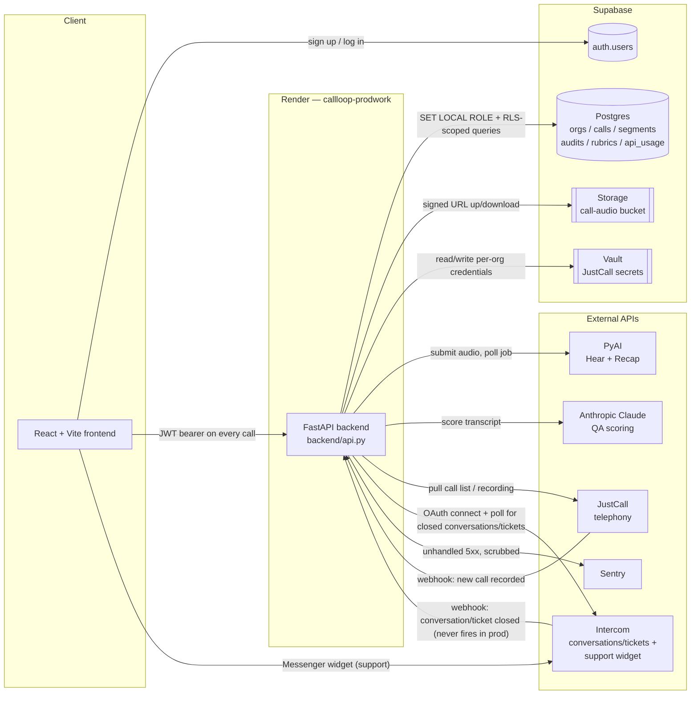

# CallLoop / CallProof — Architecture Reference

> **This is a living document.** Update it whenever a file, table, route, or
> integration is added, renamed, or removed. If you're Cursor (or any engineer)
> picking up work in this repo, read this file first — it exists so you don't
> have to reverse-engineer the codebase from scratch.
>
> Last written: 2026-09-06. Since the last pass: the admin console moved from
> `idb.call-loop.com` to `commandcenter.call-loop.com` — still a
> **shared-build** second origin (same SPA, host-gated UI — not a separate
> admin compile). Also live: a self-serve rubric builder — each org's account
> owner defines their own audit criteria (not just reweighting CallLoop's
> fixed 4 dimensions), separate from Command Center's admin-only reweighting
> tool, which stays as-is. A team can save a **library** of several named
> rubrics and switch which one is active. Sidebar: "Rubric builder", next to
> Audits (`frontend/src/pages/RubricBuilder.tsx`, `backend/rubric_builder.py`,
> `qa_v8.evaluate_custom`). Score persistence: once a call has a completed
> audit, re-scoring it (`?refresh=true`, or a retranscribe) is blocked by
> default — Claude isn't perfectly deterministic, so a re-run could change
> the score. `org_features.enable_call_rescoring` (off by default) lifts
> that per org. Recap and feedback (sentiment-tagged Strength/Improve) now
> render on the per-call Audit Detail page too, not just Agent Pulse.
>
> Also live: admin impersonation — a platform admin can "Log in as" any org
> member from Command Center's Admin page, minting a real Supabase session
> via the Admin API (`backend/impersonation.py`, `POST
> /api/admin/users/{user_id}/impersonate`), logged permanently and
> admin-only in `impersonation_log` (migration `0020`). Smoke-tested
> end-to-end against the real Supabase project — `generate_link`'s response
> nests `hashed_token` top-level, not under `properties` (confirmed, not
> assumed); `/verify` reuses the service-role key rather than needing a
> separate anon key. Jira epic AC-18.
>
> **Built but not yet shipped** (in the working tree, not committed): a
> per-call pipeline audit trail — every stage of upload -> transcribe ->
> score -> serve, including every per-criterion LLM/deterministic dispatch
> and result, and every failure with its cause, as queryable rows rather
> than just log lines (`backend/call_trail.py`, new `call_pipeline_events`
> table, migration `0021`). Viewable in Command Center: Call logs -> a
> call's "View" trail link (`frontend/src/pages/CallTrail.tsx`,
> `GET /api/admin/calls/{call_id}/trail`). "Result displayed" is tracked as
> "the audit API actually served it" (`result_served` stage) — the
> practical, backend-observable proxy; there's no way to know when
> something rendered on a screen. Jira epic: AC-24 (see §4/§6 for the exact
> instrumentation points).
>
> **2026-09-09 — Intercom integration, two separate features (IN-1 through
> IN-7, Jira space "Integrations"):**
>
> 1. **Data ingestion** — a customer's Intercom workspace (Conversations +
>    Tickets) can be connected as a second ticket source alongside PDF
>    upload, landing in the same `tickets`/`ticket_messages` tables so the
>    scorer can't tell them apart. Multi-tenant OAuth (one CallLoop-owned
>    Intercom app, many customer workspaces) — `backend/intercom_oauth.py`
>    (connect/callback/token exchange/webhook signature verification),
>    `backend/intercom_client.py` (REST client:
>    get_conversation/get_ticket/search_closed_conversations/
>    search_closed_tickets), `backend/intercom_ingest.py` (payload
>    normalization + the idempotent write path). `org_vault.py` was
>    generalized from JustCall-only (`put_justcall`/`load_justcall`) to a
>    provider-parameterized `put_credential`/`load_credential`/
>    `find_org_id_by_external_account` — JustCall's functions are now thin
>    wrappers over the general ones. Webhook-primary/polling-backstop, same
>    shape as JustCall's existing poller — **except in production, the
>    webhook half has never once fired** (confirmed via Better Stack logs:
>    zero real events for any subscribed topic, only Intercom's own `ping`
>    test pings) despite every checkable config on Intercom's side being
>    correct — endpoint URL, topic subscriptions, OAuth permission scopes,
>    workspace installation. Root cause unconfirmed (best guess: a
>    trial-plan limitation), not blocking since polling alone has proven
>    reliable. A real bug was found and fixed here too: the ticket half of
>    the poller (`search_closed_tickets`) filtered `state = "closed"`, a
>    field/value that doesn't apply to Tickets the way it does
>    Conversations (Tickets use a boolean `open` field instead) — ran
>    silently wrong (empty results, no error) for hours against a real
>    ticket before being caught via direct log inspection.
> 2. **Support widget** — unrelated second feature: CallLoop's own
>    Intercom Messenger embed for customer support, gated off the same
>    Intercom app's Messenger Security (JWT-signed, not the legacy raw-HMAC
>    scheme — Intercom's own dashboard only recognizes the JWT scheme as
>    "securely installed"). `backend/intercom_widget.py` (`user_jwt()`),
>    `GET /api/support/widget-identity`,
>    `frontend/src/components/IntercomWidget.tsx` (hand-rolled script
>    loader — the `@intercom/messenger-js-sdk` npm package's own loader
>    silently fails inside this Vite SPA, confirmed via a HAR capture; the
>    package was dropped entirely rather than worked around).
>
> New tables/columns: `tickets.external_id` (dedup),
> `tickets.provider_stats` (raw Intercom `statistics`, Conversation-only
> field, v1/unparsed), `org_credentials.external_account_id` (webhook
> routing — Intercom sends every connected workspace's events to one
> shared URL; the payload's `app_id` is the only way to resolve which org
> it's for). `org_credentials.provider` CHECK constraint relaxed from
> `IN ('justcall')` to a pattern, to admit `'intercom'` without blocking
> future providers.
>
> **Known gap, not yet built:** no frontend "Integrations" tab UI for this
> — Connect/Disconnect Intercom is backend-only (`curl`/`Postman` during
> development). See §7.
>
> **2026-09-09 — IN-13, Intercom's other pre-computed fields, captured
> raw:** overlapped substantially with IN-7's already-shipped
> `tickets.provider_stats` (Intercom's `statistics` field) — this story
> is the "capture the rest too, if cheap, no UI/scoring" half. Corrected
> while building: the story names one of these "sentiment" — Intercom
> has no such field (checked its OpenAPI spec directly). The real,
> existing analog is `conversation_rating` (a 1-5 CSAT-style rating),
> stored instead — alongside `custom_attributes`, `sla_applied`, and
> `ai_agent`, the three other real fields. All four exist only on
> Conversation, not Ticket — same asymmetry `statistics` already has.
> New column `tickets.provider_extra` (0035), separate from
> `provider_stats` rather than folding in — that column already has an
> established, documented meaning. `intercom_ingest._provider_extra()`
> extracts whichever of the four are actually present; wired into the
> conversation ingest path only, same guard as `provider_stats`.
>
> **2026-09-09 — IN-12, `audit_summary`/Top Strength/Top Gap for tickets:**
> new, for both engines — a repo-wide search turned up no existing
> call-side implementation to mirror, despite the epic's text implying
> one exists ("Top Strength/Top Gap remain fully deterministic, matching
> the existing design"). Also confirmed: recap.py (PyAI Recap, already
> used for calls) is architecturally the same category of tool the epic
> explicitly warns against reusing here — a neutral transcript summary,
> not an evaluative one — so it isn't used, same as Intercom's own
> `conversation_summary` isn't. New module `ticket_audit_summary.py`:
> `top_strength()`/`top_gap()` pick the highest-weighted pass/fail
> dimension respectively (deterministic, no Claude call); `generate_
> audit_summary()` stitches a short sentence from those two, degrading
> gracefully when either is missing. Computed fresh on every read inside
> `ticket_score_api._payload()`, from the already-TA-12-filtered
> findings — never persisted (same reasoning Response Timeliness already
> uses), and never computed from the unfiltered ticket, so a non-manager
> viewer's summary reflects only their own attributed findings, same
> boundary already enforced for `findings`/`spans`. No frontend consumes
> these new fields yet.
>
> **2026-09-09 — IN-11, Intercom attachment pipeline + first SSRF host
> allowlist:** a screenshot attached to a conversation, ticket, or any
> reply now appears, described, in the correct position in the scored
> transcript — reusing TA-5's existing describe-and-store pipeline
> unchanged, per the epic's own framing. Worth a flag: the epic assumed
> an SSRF host-allowlist mechanism already existed to extend ("just add
> the CDN domain") — it doesn't. The ticket engine had never made an
> outbound fetch of a client-controlled URL before this; JustCall's own
> "no arbitrary fetch" discipline is a single hardcoded `BASE_URL`
> constant, not reusable machinery. Built real, new allowlist logic
> instead — `intercom_client.fetch_attachment()` — confirmed against
> Intercom's own published CSP documentation (not guessed) for the real
> domain family: attachments are served from `intercomcdn.com`/`.eu`,
> `intercomusercontent.com`, `intercomassets.com`/`.eu`, and the numbered
> `intercom-attachments-1.com` through `-9.com` plus `.eu`/`au`
> variants — several domains, not one. `intercom_ingest._attachment_image_turns()`
> turns each image-type attachment on a conversation_part, ticket_part,
> or a conversation's `source` into its own turn, right after the turn
> that attached it. A ticket's own opening description has no structured
> object to carry an attachment on, unlike a conversation's `source` —
> asymmetric, and documented as such rather than assumed symmetric.
>
> **2026-09-09 — IN-10, email-keyed multi-agent identity mapping:** every
> Intercom agent turn now resolves `agent_user_id` via `author.email`
> instead of always staying `None`. Worth a flag: the epic framed this as
> a drop-in swap of TA-15's existing `ticket_agent_aliases` mechanism
> (just key on email instead of display_name) — it isn't one. That table
> is hard-keyed on `(org_id, display_name)`, a real unique constraint,
> and every resolver takes `display_name` as its parameter, not an
> arbitrary identifier. Rather than retrofit that shipped table
> (`display_name` would need to become nullable, plus a new CHECK that at
> least one identifier kind is set), built a new, parallel table —
> `ticket_agent_identity_aliases` (migration `0034`), generic on
> `(org_id, provider, identifier) -> user_id`, case-insensitive on the
> identifier. `backend/ticket_agent_identity_aliases.py` (CRUD + batched
> resolution, mirroring `ticket_agent_aliases.py`'s exact shape) +
> `ticket_agent_identity_aliases_api.py` (`/api/tickets/agent-identity-
> aliases`, owner-only, mirroring `ticket_agent_aliases_api.py`).
> `intercom_ingest._resolve_agent_identities()` resolves every unresolved
> agent turn's `speaker_name` (already the email — `_speaker_name()`
> prefers `author.email`) in one batched query per ingest, the same
> pattern `ingest_ticket_pdf()` already uses for the PDF path. **No
> frontend UI yet** for managing these mappings — API-only for now, same
> shape IN-18 was before it shipped for the OAuth connect flow.
>
> **2026-09-09 — IN-9, internal note turns are captured and tagged, not
> discarded:** the original design assumed a note-type Intercom part
> (`part_type` "note" or a "note_and_*" combined-action variant, e.g.
> "note_and_unsnooze") was non-substantive and safe to drop. Wrong — a
> real sample showed a decisive, customer-impacting decision (a
> refund-policy determination) delivered entirely through a note, never
> surfaced as a customer-facing comment. Notes are now captured and
> tagged `internal_contribution` on the turn (`ticket_messages.is_internal`,
> migration `0033`) instead of discarded or silently merged in as an
> ordinary turn. `ticket_rubric.py`'s scaffold dimensions gained a
> `customer_facing_only` flag — set on exactly one of the six ("Tone":
> can't judge tone toward a customer from something they never saw); the
> other five are deliberately left able to see internal notes, since
> that's exactly where the epic's own motivating example's substance
> lived. `ticket_scoring.run_ticket_wave` filters per-dimension
> (`_scoreable_turns`) before both prompting and evidence validation;
> span/ownership logic always sees the full, unfiltered thread.
>
> **2026-09-09 — IN-8, linked-object grouping:** a closed conversation and
> a closed ticket that Intercom links together (`linked_objects`, up to
> 1000 entries) now merge into one audited case instead of ingesting as
> two separate ones. Worth a flag: the epic's own written "resolved
> logic" (check a `ticket` field on the Conversation object) doesn't
> match Intercom's actual schema — checked directly against Intercom's
> published OpenAPI spec (`github.com/intercom/Intercom-OpenAPI`), both
> API version 2.14 (what this client requests) and current 2.16. There
> is no `ticket` field on Conversation in either version; instead,
> **both** Conversation and Ticket carry their own `linked_objects` field
> directly. Built against that verified shape instead —
> `intercom_ingest._linked_members()`/`_group_key()`/`_merge_turns()`.
> Dedup key for a grouped case is `"group:<lowest numeric id in the
> group>"`, deterministic regardless of which member is discovered first
> (a webhook on the conversation vs. the poller independently finding
> the linked ticket). Single-hop only — a member's own `linked_objects`
> isn't recursively followed.
>
> **2026-09-06 — observability follow-through (AC-42/AC-51):** the hosted
> Better Stack log sink (`applog.attach_logtail_handler`) was shipping data
> with no `service` dimension at all — nothing had ever set one, so every
> Metrics panel grouped by subsystem collapsed into one `null`/`unknown`
> bucket. `_BetterStackHandler` now stamps `record.service = record.name`
> on every log line, and `applog.event()` additionally passes every field
> it's given as `extra=` (redacted the same way the text line already is,
> reserved `LogRecord` attribute names dropped rather than raised) — so
> fields like `path`/`method`/`status`/`error` are now real top-level JSON
> keys on ingest, not just text buried inside `message`. Separately, a real
> bug was found and fixed in `pyai_usage.record_http_response()`: a bare
> `import applog` (not `from . import applog`) inside a package module
> raised `ModuleNotFoundError` on every call, silently swallowed by the
> surrounding `except Exception: pass` — meaning the `api_consumption`
> event had *never once* fired in production, for any PyAI or Claude call,
> since the day it was written. Each provider now logs under its own
> logger (`callproof.usage.pyai` / `callproof.usage.anthropic`) so the two
> are distinguishable by `service`. `backend/auth.py`'s `_auth_failure()`
> previously logged nothing at all on a 401/503 — it now emits
> `event=auth_failed` (`callproof.auth`) with `status`/`detail`/`method`/
> `path`; a 401 (expired/missing/invalid token) logs at WARNING since it's
> routine traffic, a 503 (auth misconfigured) logs at ERROR. Status/next
> steps tracked in Jira AC-51.

---

## 1. What this product is

**CallLoop** (repo/package name: `callproof`) is a call-QA SaaS product. A
company connects its call recordings (manual upload, or a JustCall telephony
integration), the platform transcribes each call with speaker diarization,
scores it against a configurable rubric using an LLM, and surfaces the score,
transcript, and flagged issues in a dashboard.

**Where it is right now:** early-stage, pre-launch, mid-migration. The
original build was a single-tenant hackathon app (SQLite on local disk, one
shared dataset). It is being rebuilt into a real multi-tenant product on
Supabase (Postgres + Auth + Storage + Vault), with each company isolated into
its own **org** and Postgres Row Level Security enforcing that isolation as a
second layer beneath the application code. The SQLite-era code path has been
fully removed — Postgres is required at runtime, there is no fallback.

**Where it's headed:** domain-based org auto-provisioning at signup (a
company's employees land in the same org automatically), a per-org
rubric-builder UI (the actual product differentiator vs. generic call-scoring
tools), more telephony integrations beyond JustCall, and an admin-facing view
of orgs/users now that real signups exist.

---

## 2. Tech stack

| Layer | Choice | Notes |
|---|---|---|
| Backend framework | **FastAPI** (Python 3.11+) | `backend/api.py` is the whole app |
| ASGI server | **Uvicorn** | `uvicorn backend.api:app` |
| Database | **Supabase Postgres** (managed) | Schema is Alembic-only, no ORM |
| DB driver | **psycopg 3** | `prepare_threshold=0` for PgBouncer/Supabase poolers |
| Migrations | **Alembic** | `alembic/versions/0001` → `0010` so far |
| Auth | **Supabase Auth** | JWT (HS256 or JWKS), verified in `backend/auth.py` |
| Tenant isolation | **Postgres RLS** + app-level `org_id` scoping | Belt and suspenders — see §5 |
| File storage | **Supabase Storage** | Private `call-audio` bucket, signed URLs |
| Secrets vault | **Supabase Vault** | Per-org JustCall credentials, encrypted |
| Error tracking | **Sentry** (`sentry-sdk[fastapi]`) | 5xx only, scrubbed, org-tagged |
| Frontend | **React 19 + TypeScript + Vite** | `frontend/` |
| Frontend auth/data client | `@supabase/supabase-js` | |
| Hosting | **Render** | `callloop-prodwork` (API) + static site `callloop-web` (customer `call-loop.com` and admin `commandcenter.call-loop.com`, AC-12 shared-build) |
| CI | **GitHub Actions** | Real Postgres container; migrate → downgrade → upgrade → pytest |

**External APIs this product depends on:**

| Service | Used for | Where |
|---|---|---|
| **PyAI — Hear** | Transcription + speaker diarization | `backend/transcribe.py` |
| **PyAI — Recap** | Turns a speaker-labelled transcript into a summary | `backend/recap.py` |
| **Anthropic Claude** | Runs the QA rubric against a transcript, produces the score | `backend/qa_engine.py` |
| **JustCall** | Telephony source — pulls call recordings, receives webhooks for new calls | `backend/justcall.py` |
| **Intercom** | Second ticket source (Conversations/Tickets, OAuth, multi-tenant) — data ingestion into `tickets`; separately, CallLoop's own support Messenger widget | `backend/intercom_oauth.py`, `intercom_client.py`, `intercom_ingest.py`, `intercom_widget.py` |
| **Sentry** | Error tracking for 5xx failures | `backend/sentry_report.py` |

---

## 3. High-level architecture



**Request flow in one line:** the frontend never talks to Postgres, Storage,
Vault, PyAI, Claude, or JustCall directly — everything goes through the
FastAPI backend, which resolves the caller's `org_id` from their JWT on every
request and scopes every downstream call to that org.

---

## 4. Repo layout — what each file is for

### Root

| File | Purpose |
|---|---|
| `api.py`, `qa_engine.py`, `transcribe.py` | **Compatibility shims only** (1–6 lines each) — re-export from `backend.*` so old commands (`uvicorn api:app`) still work. The real code is in `backend/`. Don't add logic here. |
| `test_claude.py` | Standalone manual smoke test for Anthropic connectivity — `python test_claude.py`. Not part of the pytest suite. |
| `rubric.json` | The runtime scoring rubric (legacy v8 shape), seeded into every new org's `rubrics` table. |
| `requirements.txt` | Backend Python dependencies. |
| `render.yaml` | Render Blueprint — recreates the `callloop-prodwork` service exactly (env vars, build/start commands, no persistent disk). **Start Command** runs `alembic upgrade head` then uvicorn (free plan never runs Pre-Deploy). |
| `pytest.ini` | Pytest configuration. |
| `.env.example` | Documents every required env var name with no real values. Copy to `.env` (gitignored) locally. |
| `README.md` | Setup/install/deploy instructions — the "how do I run this" doc. |
| `ARCHITECTURE.md` | This file — the "what is this and how does it fit together" doc. |
| `docs/postgres-cutover.md` | Rollback runbook for the Postgres-only cutover (app rollback vs. data rollback vs. schema rollback). |
| `docs/adr/001-tenancy-model.md` | Why shared-schema + RLS was chosen over schema/DB-per-tenant, the `org_members` RLS exception, domain-matching signup, and `DEFAULT_ORG_ID`'s actual remaining purpose. |

### `backend/` — the FastAPI app

| File | Purpose |
|---|---|
| `__init__.py` | Loads the repo-root `.env` before any sibling module reads `os.getenv`. |
| `api.py` | **The whole app.** Every HTTP route lives here (see §6 for the route table). |
| `config.py` | Env loading, CORS origins, `skip_startup()` (test/CI flag to import the app without provider bootstrap). |
| `paths.py` | Repo-root-relative paths (log dir, rubric path, `.env` path) — independent of process cwd. |
| `auth.py` | Verifies Supabase JWTs, `ensure_membership()`, `ensure_placeholder_org()` — idempotent seed of `DEFAULT_ORG_ID` for webhook/CLI/usage fallbacks only (not signup) — `require_platform_admin()`, the internal admin-console gate, and `require_owner()`, the self-serve rubric builder's gate (see §5). `is_platform_admin()` (0026) ORs the static `PLATFORM_ADMIN_EMAILS` env var with a DB-resolved flag: `ensure_membership()` calls `is_platform_admin_email()` (SECURITY DEFINER) once per request and stashes the result on `request.state.is_platform_admin_db` — no extra DB round trip, since `ensure_membership` already runs once per authenticated request regardless. `_auth_failure()` (2026-09-06) logs `event=auth_failed` under `callproof.auth` — previously logged nothing at all on any 401/503, so failed-auth traffic was invisible in Better Stack. A 401 (expired/missing/invalid token) logs at WARNING since it's routine traffic and shouldn't inflate error-rate alerts; a 503 (auth not configured) logs at ERROR since that's a real misconfiguration. |
| `platform_admins.py` | 0026/0027: DB-managed additions to the platform-admin allowlist (Command Center > Platform Admins), purely additive to `PLATFORM_ADMIN_EMAILS` — never a replacement. `platform_admins` (email PK, no org_id — platform admin is cross-tenant by definition) is explicitly `REVOKE`d from `callproof_app` (0027 — a new public-schema table is granted to it by default via 0005's `ALTER DEFAULT PRIVILEGES` unless revoked, a gotcha `org_directory` already had to handle in 0011) and RLS-enabled with zero policies as a second, independent wall. Every read/write goes through one of four SECURITY DEFINER SQL functions (`is_platform_admin_email`/`list_platform_admins`/`add_platform_admin`/`remove_platform_admin`), same convention as `admin_search_directory()`. Callers must already have passed `require_platform_admin` — this module does no permission check of its own. Internal CallLoop staff only; must never reach a customer, not even an org owner. |
| `admin_provision.py` | AC-3/AC-6/AC-7: creates a Supabase Auth user (generated password, `email_confirm: true`) plus an `org_members` row. `org_mode="new"` resolves a final org name (admin-given or auto-derived), looks it up via `org_id_for_name()` — a match joins that org as `member`; no match creates a new org as `owner`. `org_mode="existing"` targets an org id directly, unaffected by name matching. Rolls back the auth user if the org/membership insert fails. Response includes `created: bool` so the caller knows which happened. Callers must already have passed `require_platform_admin`; the module itself doesn't re-check. Password is returned once, never logged (enforced by a static test). |
| `org_features.py` | AC-4/AC-5: `features_for_org()` (read, org-scoped, defaults missing keys to enabled) and `set_feature()` (upsert, admin-gated caller). `enable_call_rescoring` (off by default) gates whether an already-audited call can ever be re-scored — see `api._load_or_compute_audit`. AC-36: `FEATURE_DEFINITIONS` is now the single source of truth per flag (label, description, `risk: "low"\|"medium"\|"danger"`, default_enabled) — `FEATURE_KEYS`/`DEFAULT_OFF_KEYS` are *derived* from it, not maintained separately, so they can't drift apart again. `feature_definitions()` serves this metadata for Command Center's Flags tab to group Low/Medium/Danger and gate a confirmation prompt on danger-tier toggles generically — add a flag here with a risk tier and no frontend change is needed for it to show up correctly grouped. Today `enable_bulk_call_clear` is the only `danger`-tier flag (hard-delete-adjacent, org-wide); `use_selfhosted_transcription`/`enable_call_rescoring`/`enable_ticket_rescoring` are `medium` (real behavior change, not destructive); the rest are `low` (cosmetic UI/nav toggles). |
| `admin_console.py` | AC-5: directory search (via the `admin_search_directory` SQL function, never `org_directory` directly), org usage/cost lookup (`org_scope()` redirects `pyai_usage.usage_summary()`'s ambient RLS scoping to the *queried* org), and the feature-write entrypoint the admin panel calls. AC-33: `search_orgs()` — a second, independent function (`admin_search_orgs`) returning one row per org (name, short_ids, member_count, created_at) for Command Center's master-detail directory table; `admin_search_directory` is untouched and keeps its per-member shape, since the Members tab (AC-34) still needs that. `_json_value()` now recurses into lists — needed for `short_ids` (a Postgres array column), which it previously would have stringified instead of returning as real JSON. AC-35: `usage_daily_for_org()` — same `org_scope(oid)`-on-the-*queried*-org pattern as `usage_for_org()`, wrapping `pyai_usage.usage_daily()`; `days` defaults to 30, clamped to 365. |
| `product_events.py` | AC-43/44/45 (observability PRD §4): `track_event()` persists a fifth instance of the append-only, org-scoped events-table pattern (`impersonation_log`/`password_reset_events`/`org_features_history`/`call_trail`). `ALLOWED_EVENTS` is a deliberately closed allowlist (the PRD's own "dumping ground" risk) split into `BACKEND_WIRED_EVENTS` (called directly from the route/service already handling that action — `ticket_api.py`, `rubric_builder.py`, `api.py`'s upload/flag/solve/feedback/stakeholder-email routes) and `FRONTEND_ONLY_EVENTS` (page views, `session_started` — reachable only via `POST /api/events`, which rejects any backend-wired name so the browser can never fabricate one). Best-effort by design: never raises, logs and returns on any failure — a telemetry bug must not break the feature it's attached to. |
| `org_ids.py` | Tenant-id plumbing: `contextvars`-based `bind_org_id`/`bound_org_id`/`org_scope`, `DEFAULT_ORG_ID`/`DEFAULT_RUBRIC_ID` constants (still used by background/webhook fallback paths, **not** by human signup anymore). |
| `db.py` | Opens Postgres connections, runs `SET LOCAL ROLE callproof_app` + sets the tenant GUCs (`app.current_org_id`, `app.current_user_id`) so RLS applies. `bypass_rls=True` is a narrowly-scoped escape hatch for specific admin/background paths only — see the comment in that file before ever reaching for it. |
| `db_url.py` | Reads and normalizes `DATABASE_URL`/`SUPABASE_DB_URL`. Never logs it (embeds a password). |
| `audit_store.py` | Reads/writes `audits` and `rubrics` rows; seeds the legacy rubric for new orgs. `insert_weighted_version()` (CR-13, Command Center reweighting) and `insert_custom_definition()` (self-serve builder, arbitrary dimension set) are separate functions on purpose — same versioning discipline, kept apart so the admin-only tool stays untouched by the self-serve one. `fetch_active_rubric()` explicitly excludes `definition->>'kind' = 'ticket'` rows (TA-13) — the ticket engine's "Ticket QA" rubric lives in this same table with no schema change, sharing the org-wide `is_active` column, so this exclusion is what keeps a real call from ever getting handed the ticket rubric. |
| `rubric_builder.py` | Self-serve rubric builder (customer-facing, gated by `auth.require_owner`, not admin): a team's own mix of built-in dimensions (reused unchanged from `rubric.json` unless the team edits their criteria text, which converts that one to a custom dimension — a built-in's deterministic logic isn't rewritable by text) and free-text custom ones (`method: "custom_llm"`, Claude-judged). A **multi-rubric library**: teams save several independently-versioned named rubrics (`audit_store.save_named_rubric`/`list_rubric_lineages`/`activate_rubric_by_name`), at most one active org-wide at a time — same `rubrics` schema, no migration. Deliberately separate from `admin_console.py`. |
| `audio_store.py` | Uploads/downloads call recordings to/from the private Supabase Storage bucket; issues signed URLs. |
| `audio_backfill.py` | One-off CLI (`python -m backend.audio_backfill`) to push any leftover local recordings into Storage. |
| `org_vault.py` | Per-org provider credentials in Supabase Vault (IN-3: generalized from JustCall-only). `put_credential`/`load_credential`/`delete_credential`/`credential_status` take a `provider` string; `find_org_id_by_external_account(provider, external_account_id)` resolves an org from a provider-side workspace id (Intercom's webhook routing — see `intercom_oauth.py`). `put_justcall`/`load_justcall`/`delete_justcall` are now thin wrappers over the general functions, unchanged externally. Plaintext secrets never touch a table; only a key suffix (and, for Intercom, the external account id) is indexed in `org_credentials`. Any caller must already be inside `org_scope(org_id)` — a public route (webhook/OAuth callback) that isn't will hit an uncaught RLS violation, not a clean error (caught live once, IN-4). `put_credential`'s `ON CONFLICT (org_id, provider)` upsert only makes *that org* reconnecting idempotent — it does not cover the separate `(provider, external_account_id)` unique index, so a second org trying to link a workspace already claimed by a different org raises a raw `UniqueViolation` there instead. `CredentialConflict` (`VaultError` subclass) catches that specific constraint by name and turns it into a clean, callable error — caught live during IN-15's own pilot (the first real second-org attempt this code had ever seen). |
| `env_keys.py` | Validates allowlisted API-key formats. Never logs secret values. |
| `justcall.py` | JustCall REST client — pagination (0-indexed), call list, recording download, webhook signature verification. |
| `intercom_oauth.py` | IN-3/IN-4. Multi-tenant Intercom OAuth (one CallLoop-owned app, many customer workspaces — connecting per-customer means an OAuth flow, not a bare API key like JustCall). `client_id`/`client_secret`/`is_configured`, `make_state`/`verify_state` (HMAC-signed org_id+timestamp, no server-side session table), `build_authorize_url`, `exchange_code_for_token`, `fetch_workspace_id()` (`GET /me` → `app.id_code`, captured at connect time as `org_credentials.external_account_id`), `verify_webhook_signature()` (HMAC-SHA1 over the raw body, keyed by the OAuth client secret — a *different* secret from the Messenger Security "Unified Secret" `intercom_widget.py` uses), `poll_seconds()` (env `INTERCOM_POLL_SECONDS`, default 300, floor 30). |
| `intercom_client.py` | IN-5/IN-6/IN-7/IN-11. Thin REST wrapper, same role as `justcall.py`. `get_conversation`/`get_ticket` (single object fetch). `search_closed_conversations`/`search_closed_tickets` (`POST /conversations\|tickets/search` — the plain List endpoints support no state/date filtering at all, only pagination, so Search is the only usable endpoint for "what closed recently"). The ticket filter is `open = false` (a boolean) — **not** a `state = "closed"` string the way Conversations use; that was a real bug (IN-6), Tickets don't share Conversations' state vocabulary, confirmed live via a real ticket that sat unmatched across 12+ poll cycles with no error before being caught. IN-11: `fetch_attachment()` — the ticket engine's first-ever outbound fetch of a client-controlled URL, gated by a real host allowlist (`_attachment_host_allowed()`) confirmed against Intercom's own CSP docs, not a wildcard. Raises `DisallowedAttachmentHost` rather than silently skipping anything off that list. |
| `intercom_ingest.py` | IN-5/IN-6/IN-7/IN-8/IN-9/IN-10/IN-11/IN-13. Normalizes a fetched Conversation or Ticket into the same canonical turn shape `ticket_pdf_parser.parse_turns()` produces, so `ticket_ingest.py`'s DB-writing functions and the scorer need zero changes to handle an Intercom-sourced ticket. Field-mapping gotchas found against Intercom's real schema (not guessed): a conversation's opening message lives in a separate `source` object, not in `conversation_parts` (which is only the replies/notes after); `conversation_parts.conversation_parts` is doubly-nested; a Ticket's opening content is `ticket_attributes._default_description_` (a plain string, attributed to `contacts[0]`); `ticket_parts` share `conversation_parts`' exact shape. `_external_id()` namespaces ids by kind (`"conversation:<id>"` / `"ticket:<id>"`) for a standalone object; a grouped object (IN-8) instead gets `_group_key()`'s `"group:<lowest numeric id in the group>"`. `statistics` (IN-7, first-response/resolution timing) is wired into the conversation path only — confirmed against Intercom's own reference that this field exists on Conversation, not Ticket, stored as-is in `tickets.provider_stats` (v1, unparsed, not surfaced); skipped entirely for a grouped case (no single unambiguous "the" statistics object). IN-8: `_linked_members()`/`_group_key()`/`_merge_turns()` — a conversation or ticket with a non-empty `linked_objects` (checked against Intercom's real OpenAPI schema, not the epic's own stated logic — see ARCHITECTURE.md's 2026-09-09 changelog entry) merges with every linked member into one case, chronologically ordered, single-hop only. `_ingest_intercom_object()` is the shared implementation both `ingest_intercom_conversation`/`ingest_intercom_ticket` delegate to — the object's own fetch happens *before* `create_ticket` now (its `linked_objects` must be known to compute the real dedup key first), so a fetch failure on a never-seen object creates no row at all, unlike a failure fetching a linked member after the row already exists. IN-9: `_is_internal_note()` tags a note-type part (`part_type == "note"` or a `"note_and_*"` variant — matched by prefix, since Intercom's own OpenAPI spec doesn't enumerate this field as a closed list) — captured as a normal turn, not discarded, with `internal_contribution: True` set on it. IN-10: `_resolve_agent_identities()` resolves every unresolved agent turn's `speaker_name` (already the email) against `ticket_agent_identity_aliases`, batched — one query per ingest, same pattern `ticket_ingest.ingest_ticket_pdf()` uses for the PDF path. IN-11: `_attachment_image_turns()` — one turn per image-type attachment on a `conversation_part`, `ticket_part`, or a conversation's `source`, placed right after the turn that attached it, reusing `ticket_image_extraction.describe_image()` unchanged. `_ingest_intercom_object()` stores each via `ticket_image_store.put_bytes()` + `ticket_ingest.insert_ticket_message_assets()` after `insert_ticket_messages()`, same shape `ingest_ticket_pdf()` already uses for a PDF's embedded screenshots. Any attachment failure (disallowed host, fetch, vision call) propagates and marks the ticket failed — never silently skipped. IN-13: `_provider_extra()` — Intercom's `conversation_rating`/`custom_attributes`/`sla_applied`/`ai_agent`, captured raw into `tickets.provider_extra` whichever are present; conversation path only, same asymmetry as `statistics`. |
| `intercom_widget.py` | Unrelated to the OAuth data-ingestion integration above — CallLoop's own Intercom Messenger embed for customer support. `user_jwt(user_id, email)` — HS256, signed with `INTERCOM_MESSENGER_SECRET` ("Unified Secret," from Intercom's Messenger Security settings, not the OAuth app's client secret). Replaced an earlier raw-HMAC `user_hash()` implementation after finding Intercom's own dashboard only marks a Messenger install as "securely installed" under the newer JWT scheme — the old hash still works for backward compatibility but doesn't satisfy Intercom's own check. |
| `transcribe.py` | Submits audio to PyAI Hear, polls until done, picks channel-split vs. diarize mode, persists the transcript. |
| `recap.py` | PyAI Recap client — turns a speaker-labelled transcript into a summary. |
| `qa_engine.py` | Runs the rubric against a transcript via Claude, produces a deterministic score. Shared with the ticket engine only via `build_prompt` / `call_claude` / `validate_evidence` — ticket scoring must not grow any other import from this file. |
| `rules.py`, `rules_v8.py`, `qa_v8.py` | Deterministic rule/rubric implementations the QA engine calls into (v8 is the current rubric shape). `qa_v8.evaluate_dimension()`'s dispatch is by dimension `id` for the 4 built-ins, falling through to a generic `method: "custom_llm"` branch (`evaluate_custom()`) for a self-serve team's own free-text criteria — reuses the exact `build_prompt`/`call_claude`/`validate_evidence` pipeline the built-ins use, no bespoke prompt per criterion. `run_v8_wave()` already scales its worker pool to however many dimensions the rubric has — no changes needed there for an arbitrary dimension count. Ticket auditing does not import these files. |
| `ticket_pdf_parser.py` | TA-4/TA-5/TA-13. Deterministic JustCall PDF-export parser. `parse_ticket_pdf()` → ordered `{seq, speaker, speaker_name, agent_user_id, text, sent_at}` turns (no Claude, no `transcribe.py`). `agent_user_id` is always `None` here — this parser only reads the raw display name off the PDF and does no resolution itself (no DB access); `ticket_ingest.py` does the actual name→user_id lookup (TA-15). `parse_turns_with_pages()` additionally tags each turn with the page it started on, so `ticket_ingest.py` can place an embedded image at the right point in the sequence instead of only at the end. `sent_at` (TA-13) combines each turn's `HH:MM AM/PM` with its day header and the export's own stated UTC offset — real per-message timestamps, the raw data Response Timeliness needs. |
| `ticket_rubric.py` | TA-7/TA-13. `SCAFFOLD_TICKET_RUBRIC` — six LLM-judged dimensions (still not the final design, PRD §4/§11). `ensure_ticket_rubric()`/`fetch_active_ticket_rubric()` store/read the org's "Ticket QA" rubric as a real `rubrics`-table row (PRD §10, no schema change — a `definition->>'kind' = 'ticket'` marker distinguishes it from call rubrics). `evaluate_response_timeliness()` is the seventh, deterministic dimension — real elapsed time between a customer message and the next agent reply, from `sent_at`; not folded into `score_ticket()`'s weighted score for v1, returned as its own finding instead. IN-9: each dimension may carry `customer_facing_only` — only `"tone"` has it; the other five deliberately can see internal Intercom notes. |
| `ticket_image_extraction.py` | TA-5. `extract_images()` pulls embedded raster objects out of a PDF (pypdfium2); `describe_image()` is one Claude vision call per image. Standalone — no import from the call-scoring engine. Real JustCall exports currently yield no image XObjects (screenshots flatten to a literal `[Image]` text token on export), so this only fires for a source that actually embeds real image data; validated live against a synthetic PDF + the real Anthropic API. |
| `ticket_image_store.py` | TA-5. Private per-org Storage for ticket screenshots (`ticket-images` bucket), same shape as `audio_store.py` for call audio — signed URLs only, never a public read policy. |
| `ticket_ingest.py` | TA-4/TA-5/TA-15 write path. `ingest_ticket_pdf()`: parses text turns + embedded images, `interleave_images()` merges an image into the turn sequence right after the last text turn on the same PDF page (inheriting that turn's speaker — the closest signal available without exact on-page coordinates), resolves each agent turn's raw `speaker_name` against the org's `ticket_agent_aliases` mapping (TA-15, batched one query per ingest via `resolve_agent_user_ids()`) before writing to `ticket_messages`, stores each image via `ticket_image_store` + a `ticket_message_assets` row. `insert_ticket_messages()` also persists `speaker_display_name` (TA-15, generalized 2026-09-12) — the raw name/identifier for *every* turn regardless of role, not just agents, so an org owner has agent names to map and the ticket UI has a real customer name to show instead of the generic role label. `get_ticket()` returns it per message as `speaker_display_name` (the raw identifier, unchanged) and `display_name` (found live via a real pilot ticket that showed a resolved agent's raw email instead of their name: an `org_members` lookup for any turn's resolved `agent_user_id`, preferring that real name over the raw identifier — falling back to `speaker_display_name` only when unresolved, or when a resolved member has no name on file). Any failure anywhere in the pipeline marks the ticket `failed` and re-raises — nothing partial is left looking like a successful ingest. Scoring (TA-6) needs zero changes: an image-derived turn is just a normal turn in the sequence. Also the org-scoped reads behind `/api/tickets` (`list_tickets` / `get_ticket`). IN-5/IN-6/IN-7: `create_ticket()`/`find_ticket_by_external_id()` gained a provider-agnostic `external_id` (dedup — a retried Intercom webhook delivery must not create a duplicate ticket), and `set_ticket_provider_stats()` writes a provider's raw per-ticket statistics object (`tickets.provider_stats`) — `intercom_ingest.py` is the only caller today. |
| `ticket_agent_aliases.py` | TA-15. Org owner-managed mapping from a ticket PDF's raw agent display name (e.g. "Kashif") to a real `org_members.user_id` — closes the gap where every PDF-sourced agent turn's `agent_user_id` was permanently `None`, collapsing TA-8's multi-agent attribution into one undifferentiated span. `resolve_agent_user_ids()` (batch, one query per ingest) is what `ticket_ingest.py` calls; `list_unresolved_agent_names()` reads back real agent turns with no resolved id, for an org owner's own mapping to-do list; `list_org_agents()` is the roster for a mapping-picker UI. **`set_alias()` now backfills already-ingested, still-unresolved turns for that exact name in the same transaction** (2026-09-12, reversing the original "not retroactive" v1 boundary) — found live that the old boundary broke the core review workflow: a teammate opening a ticket they were literally the agent on saw a blank thread, since TA-12's own-turns-only viewer filter correctly found nothing when their `agent_user_id` was still `NULL` on their own past turns. |
| `ticket_agent_aliases_api.py` | TA-15. `/api/tickets/agent-aliases` HTTP surface — GET (current mappings + unresolved names + org roster), POST (create/update one mapping), DELETE `/{display_name}`. Every mutation is `auth.require_owner`-gated, same tier as the rubric builder and `org_features` toggles. Separate file from `ticket_api.py` (Cursor's, TA-9) by design, to avoid touching it while both are worked on the same tree; registered *before* `ticket_api.register(app)` in `api.py` so its literal `/api/tickets/agent-aliases` path isn't swallowed by `ticket_api.py`'s `GET /api/tickets/{ticket_id}`. |
| `ticket_agent_identity_aliases.py` | IN-10. Org owner-managed mapping from a provider's structured agent identifier (Intercom's `author.email`) to a real `org_members.user_id` — parallel to `ticket_agent_aliases.py` (TA-15's freeform PDF display names), not a variant of it, since email is a genuinely different identifier kind (case-insensitive, structured) from a raw PDF name. Generic on `(org_id, provider, identifier)`, not Intercom-specific at the schema level, so a future provider's own identifier type slots in without a new table. `resolve_agent_user_ids()` is the batch form `intercom_ingest.py` calls. `list_unresolved_identifiers()`/`suggest_identity_matches()` (2026-09-12, competitive gap found against MaestroQA's own Intercom integration, which syncs Intercom's Admins object directly): `speaker_display_name` (TA-17) now gives every unresolved agent turn a raw identifier the same way TA-15's PDF names already had one, and since an Intercom agent's email is often their real CallLoop login too, an exact case-insensitive match against this org's own members pre-fills a suggestion — never auto-applied, an owner still confirms it. `org_directory` (email lookup) is deliberately REVOKEd from `callproof_app` (0011's own comment), so this is the one function in the file that needs `bypass_rls` — narrowly scoped with an explicit `org_id` filter in the same query, same category as `org_vault.py`'s poller listing. A file-local test (`test_module_only_bypasses_rls_for_the_org_directory_suggestion_lookup`) keeps that bypass confined to exactly this one function. **`set_alias()` now also backfills already-ingested, still-unresolved turns for that exact identifier in the same transaction** (2026-09-12) — same fix and same reason as `ticket_agent_aliases.py`'s row above; found live when a teammate whose alias had just been set still saw a blank ticket thread for a conversation they were literally the agent on. |
| `ticket_agent_identity_aliases_api.py` | IN-10. `/api/tickets/agent-identity-aliases` HTTP surface — GET (current mappings, unresolved identifiers with suggested matches, and the org roster), POST (create/update one mapping, `provider` defaults to `"intercom"`), DELETE `/{provider}/{identifier}`. Owner-only, same tier as TA-15's own alias routes. Registered before `ticket_api.py`'s `/api/tickets/{ticket_id}`, same routing-order concern TA-15's own routes already guard against. Frontend: `TicketAudit.tsx`'s `IntercomIdentityAliasMapping` (2026-09-12), mirroring `AgentAliasMapping`'s pattern but pre-selecting a suggested teammate in the picker when the backend found one. |
| `ticket_api.py` | TA-9. `/api/tickets` HTTP surface. `POST /api/tickets/upload` accepts a PDF and hands it to `ingest_ticket_pdf` — not `/api/upload`. JWT org_id only. `GET /api/tickets/{id}` and `GET /api/tickets/mine` apply TA-12's permission filter (`ticket_permissions.py`) before returning. |
| `ticket_permissions.py` | TA-12. Manager (org `owner`, standing in for "manager" — no team-admin tier yet) sees the full thread and every finding. Anyone else sees only turns inside their own agent span and only findings attributed to them, via pure functions reusing `ticket_scoring.agent_spans()` — no new mechanism (PRD §7), same narrow-then-broad shape as `auth.require_owner`/`require_platform_admin`. |
| `ticket_scoring.py` | TA-6. Ticket engine's own evaluation loop (`run_ticket_wave` / `score_ticket`). Imports only `build_prompt`, `call_claude`, `validate_evidence` from `qa_engine.py`. v1 scores the whole thread once; `agent_spans` / `primary_owner` / evidence-seq attribution are the TA-8 multi-agent data, not per-span re-scoring. IN-9: `_scoreable_turns()` filters out `internal_contribution` turns before both prompting and evidence validation for a `customer_facing_only` dimension — filters, never renumbers, so `evidence_seq` still indexes the real thread for `attributed_agent()`, which always sees the full turns list regardless. |
| `ticket_score_api.py` | TA-10/TA-11/TA-13/IN-12. `POST /api/tickets/{ticket_id}/score` scores against the org's real "Ticket QA" rubric (`ensure_ticket_rubric()`), then appends the deterministic Response Timeliness finding fresh on every response (never persisted, never TA-12-filtered — it's a whole-thread metric, not one agent's score). First score persists the six LLM-judged findings to `ticket_audits`; a later POST returns the stored scorecard. `?refresh=true` is 403 unless `enable_ticket_rescoring` is on (off by default). IN-12: `_payload()` also computes `top_strength`/`top_gap`/`audit_summary` (`ticket_audit_summary.py`) from the already-TA-12-filtered findings, before Response Timeliness gets appended — never persisted, never computed from the unfiltered ticket. |
| `ticket_audit_summary.py` | IN-12. `top_strength()`/`top_gap()` (deterministic, no Claude call — highest-weighted pass/fail dimension respectively) and `generate_audit_summary()` (a short sentence stitched from those two). Built fresh from CallLoop's own per-dimension scoring output only — never Intercom's `conversation_summary`, never PyAI's Recap (`recap.py`, already used for calls) — both are the same category of neutral transcript summary the epic explicitly says isn't a substitute for an evaluative one. Callers must pass already-viewer-filtered findings (TA-12); this module has no permissions awareness of its own. |
| `ticket_audit_store.py` | TA-11. Org-scoped read/upsert for `ticket_audits`. Not `audit_store.py` (that is calls). |
| `pyai_usage.py` | Local counters for outbound PyAI/Claude API calls (PyAI has no "requests used today" endpoint of its own), writing to `api_usage`. `record_http_response()` also emits an `applog.event(..., "api_consumption", provider=...)` line — this was silently broken from the day it was written (a bare `import applog` inside a package module, `ModuleNotFoundError` swallowed by the surrounding `except Exception`, fixed 2026-09-06) so it had never actually logged once in production. Now logs under a provider-scoped logger (`callproof.usage.pyai` / `callproof.usage.anthropic`) so Better Stack's `service` field can separate the two. AC-35: `usage_daily()` — real per-day counts (hits/actions/polls/units) for the org overview chart, replacing the design mock's `Math.random()`. Same action/poll classification as `usage_summary()` (POST = action, GET on a poll path = poll), grouped by day with every day in the range zero-filled via a `generate_series` CTE so the frontend gets a continuous series. Has no `DEFAULT_ORG_ID` bootstrapping special-case of its own — like `usage_summary()`, it depends on the caller's `org_scope()` for RLS. Live-verified: its per-day sum matches `usage_summary()`'s total for the identical window exactly. |
| `cost_estimate.py` | Estimates spend from usage counters, using cost-per-unit knobs from `.env`. |
| `email_notify.py` | Opens a prefilled Gmail compose tab for a churn/stakeholder alert — no email is sent server-side. |
| `error_notify.py` | Local desktop error notification helper (macOS banner on API 5xx during dev). |
| `impersonation.py` | AC-18. Platform-admin "log in as": mints a real Supabase session for an org member via the Admin REST API (`generate_link` + `verify`, raw `httpx`, matching `admin_provision.py`'s pattern — not the `supabase-py` SDK), records one permanent `impersonation_log` row only after both Supabase calls succeed. Admin-only, no live consent step — the log is the accountability mechanism, not a gate. |
| `call_trail.py` | AC-24/AC-26, **built, not yet shipped.** `record(call_id, org_id, stage, status, *, detail=None, error=None)` — best-effort append to `call_pipeline_events` (never raises; a trail-write failure must not break the pipeline step it describes). Called alongside the existing `applog.event()` calls at each real stage — upload/transcription, per-criterion scoring (via `qa_v8.run_v8_wave`'s injected `on_dimension_event` callback), recap, final audit result, and every `result_served`. `history(call_id, org_id)` reads it back in order for the admin trail viewer. |
| `sentry_report.py` | Sentry init + `before_send` scrubbing hook — drops 4xx, strips PII/secrets, tags `org_id`. `traces_sample_rate` defaults to 0.1 (`SENTRY_TRACES_SAMPLE_RATE`) so sampled requests send a performance trace. |
| `tracing.py` | Best-effort Sentry child spans. `span()` wraps PyAI/Claude/ticket steps; `dimension_event()` is the AC-24 `on_dimension_event` companion (started opens, succeeded/failed closes). Never raises into scoring. |
| `applog.py` | Structured event logging (`applog.event(...)`) plus secret redaction. AC-47: `_RedactFilter` is attached to the `callproof` *logger* (not just the file handler) — it mutates `record.msg`/`args` in place before any handler sees it, so it covers console output too (whatever handler `logging.basicConfig()`'s root config backs, via propagation), not just the rotating file. AC-48: `RequestIdMiddleware` binds one correlation id per request via a contextvar (same pattern as `org_ids.py`'s `bind_org_id`), and `event()` includes it in every line automatically when one is bound — registered outermost in `api.py` so it covers every request, not just authenticated ones. Additive Better Stack (Logtail) handler when `BETTERSTACK_SOURCE_TOKEN` is set — fail-open, does not replace the rotating file. `_BetterStackHandler.emit()` stamps `record.service = record.name` on every line (2026-09-06) — the logger name is what Better Stack's `service` dashboard dimension actually reads; nothing set it before this, so every subsystem-grouped panel showed `null`. `event()` also attaches every field it's given as `extra=` (same redaction as the text line; reserved `LogRecord` attribute names silently dropped rather than raised) so fields like `path`/`status`/`error` land as real top-level JSON keys on ingest, not just text inside `message` — required for Better Stack to group/filter on them at all. |

### `alembic/` — schema history (the source of truth for the DB)

Schema changes only ever happen here — never as ad-hoc SQL in `backend/`.

| Revision | What it did |
|---|---|
| `0001_orgs_calls_segments_audits` | `orgs` + `calls`/`segments`/`audits` with `org_id NOT NULL` on every table from the start. Seeds a placeholder `orgs` row (`DEFAULT_ORG_ID`, name `"default"`) still used by non-signup fallback paths. |
| `0002_api_usage` | `api_usage` table, org-scoped. |
| `0003_rubrics_audits` | Drops and recreates `audits` with a surrogate UUID PK to support multiple rubrics per org; adds `rubrics`. |
| `0004_org_members` | `org_members` — maps a Supabase `auth.users.id` to an `org_id` + role. Auth-only, not used for query scoping. |
| `0005_rls` | Enables RLS + CRUD policies on every tenant table, creates the `callproof_app` role (`NOLOGIN NOSUPERUSER NOBYPASSRLS`). |
| `0006_rls_role_grant` | Grants `callproof_app` to the DB login so `SET ROLE` actually works. |
| `0007_org_members_no_rls` | Explicitly disables RLS on `org_members` — a brand-new signup can't have an org GUC yet, so RLS on this one table would deadlock its own bootstrap. |
| `0008_storage_audio_bucket` | Creates the private `call-audio` Storage bucket (no-ops gracefully on plain Postgres without Supabase's `storage` schema). |
| `0009_org_vault_justcall` | `org_credentials` index table (org_id, provider, key suffix only) — the actual secrets live in Supabase Vault. |
| `0010_orgs_domain_column` | `orgs.domain` (nullable, unique) + a `SECURITY DEFINER` SQL function `org_id_for_domain()` used to resolve a same-company signup race without opening an RLS-bypassing connection from application code. |
| `0011_org_members_names_and_directory_view` | `org_members.first_name` / `last_name` (nullable, no backfill). `org_directory` view (email + names + org) is **admin SQL only** — not granted to `callproof_app`, not served by the API. |
| `0012_org_members_short_id` | `org_members.short_id` unique integer from sequence starting at 100000 (`DEFAULT nextval`). **GRANT USAGE, SELECT** on the sequence to `callproof_app` is required for inserts. `org_directory` also selects `short_id`. |
| `0013_org_features` | `org_features` table (AC-4) — per-org flag overrides, missing rows default to enabled. Also adds `org_members.first_seen` / `last_sign_in` for the admin directory. |
| `0014_org_features_write` | Write-side policies for `org_features` (AC-5) plus the `admin_search_directory` `SECURITY DEFINER` SQL function the admin panel's directory search goes through instead of selecting `org_directory` directly. |
| `0015_org_id_for_name` | `org_id_for_name()` `SECURITY DEFINER` function (AC-7) — lets admin provisioning join an existing same-name org instead of creating a duplicate, without an RLS-bypassing connection. |
| `0022_tickets` | `tickets` + `ticket_messages` (TA-3). Ticket auditing is a separate engine from calls. `tickets` is mutable (`status`); `ticket_messages` is append-only. `agent_user_id` nullable FK to `org_members(user_id)` for TA-8. RLS in this revision. |
| `0023_ticket_image_assets` | Private `ticket-images` Storage bucket (no-ops on plain Postgres, same pattern as `0008_storage_audio_bucket`) + `ticket_message_assets` (TA-5) — metadata only, no image bytes in Postgres. FK'd on `(ticket_id, seq)` rather than `ticket_messages.id`, so the insert doesn't need to round-trip a returned id. Append-only, RLS in this revision. |
| `0024_ticket_audits` | `ticket_audits` (TA-11). One stored scorecard per ticket. RLS SELECT/INSERT/UPDATE. Makes the rescoring guard enforceable. |
| `0025_ticket_agent_aliases` | `ticket_agent_aliases` (TA-15) — org owner-managed name→`org_members.user_id` mapping, config not an audit trail (SELECT/INSERT/UPDATE/DELETE, same shape as `org_features`), `UNIQUE (org_id, display_name)`. Also `ticket_messages.agent_display_name TEXT` — the raw PDF name for every agent turn, nullable, previously parsed and discarded. `agent_user_id` on already-ingested tickets is now backfilled when a matching alias is created (2026-09-12) — see `ticket_agent_aliases.py`'s row above. |
| `0026_platform_admins` | `platform_admins` (email PK, no org_id) — DB-managed extension of the static `PLATFORM_ADMIN_EMAILS` allowlist. No explicit GRANT in this migration; RLS enabled with zero policies. Four SECURITY DEFINER functions (`is_platform_admin_email`/`list_platform_admins`/`add_platform_admin`/`remove_platform_admin`), `SET search_path = public`, `REVOKE ALL FROM PUBLIC` then `GRANT EXECUTE` to `callproof_app` only — same convention as `admin_search_directory`/`org_id_for_name` (0014/0015). |
| `0027_platform_admins_revoke` | `platform_admins` inherited SELECT/INSERT/UPDATE/DELETE from 0005's `ALTER DEFAULT PRIVILEGES` (applies to every new public-schema table unless revoked — caught live, right after 0026 deployed, by a test asserting the grant was empty). RLS alone already blocked `callproof_app` (verified: SELECT returned zero rows, INSERT raised `InsufficientPrivilege`), but this explicitly `REVOKE`s the grant so it doesn't rely on RLS alone. |
| `0028_product_events` | `product_events` (AC-43, observability PRD) — append-only usage telemetry, same convention as `call_pipeline_events`/`impersonation_log`: `id, org_id, user_id (nullable), event_name, properties JSONB, created_at`, GRANT SELECT+INSERT only, RLS org-scoped via `callproof_current_org_id()`. `user_id` has no FK — some future event source may have none. |
| `0029_admin_search_orgs` | `admin_search_orgs(p_q text)` (AC-33, Command Center Redesign) — SECURITY DEFINER, same convention as `admin_search_directory`/`org_id_for_name`/`platform_admins`. Reads `orgs`/`org_members` directly (not through `org_directory`) since it needs the org's own `created_at`, not a membership row's. A second function alongside `admin_search_directory`, not a replacement. |
| `0030_org_credentials_provider` | Relaxes `org_credentials.provider`'s CHECK from `IN ('justcall')` to a pattern (`^[a-z][a-z0-9_]*`) — admits `'intercom'` (IN-3) without hardcoding a second literal, and without blocking whatever provider comes after it. |
| `0031_ticket_intercom_dedup` | `tickets.external_id` (IN-5, dedup — unique per `(org_id, source, external_id)` when set, same pattern as `calls.external_id`) + `org_credentials.external_account_id` (IN-4, unique per `(provider, external_account_id)` — Intercom sends every connected workspace's webhooks to one shared app-wide URL; the payload's `app_id` is the only way to resolve which org an event belongs to, so this is the lookup index). |
| `0032_ticket_provider_stats` | `tickets.provider_stats JSONB` (IN-7) — a provider's raw per-ticket statistics object (Intercom's `statistics` field: first-response/resolution timing). v1: stored as-is, unparsed, not surfaced in the UI yet. NULL for PDF-sourced tickets. |
| `0033_ticket_messages_internal` | `ticket_messages.is_internal BOOLEAN NOT NULL DEFAULT false` (IN-9) — tags a note-type Intercom part (captured, not discarded) so scoring can exclude it from a `customer_facing_only` dimension. Not retroactive on rows ingested before this shipped. |
| `0034_ticket_agent_id_alias` | `ticket_agent_identity_aliases` (IN-10) — org owner-managed mapping from a provider's structured agent identifier (Intercom's `author.email`) to a real `org_members.user_id`. Generic on `(org_id, provider, identifier)`, parallel to `ticket_agent_aliases` (TA-15's freeform PDF display names) rather than a retrofit of it — a genuinely different identifier kind. Same RLS/grant shape as that table. |
| `0035_ticket_provider_extra` | `tickets.provider_extra JSONB` (IN-13) — Intercom's `conversation_rating`/`custom_attributes`/`sla_applied`/`ai_agent`, captured raw, unused (no UI/scoring yet), whichever of the four are actually present. Separate column from `provider_stats` (0032) rather than folding in. NULL for PDF-sourced tickets and for Intercom tickets (none of these fields exist on that object). |
| `0036_ticket_speaker_display_name` | Renames `ticket_messages.agent_display_name` → `speaker_display_name`. Found live during IN-15's pilot: a customer turn's raw name/email was computed at parse time on both ingestion paths but discarded before the write (TA-15's column was deliberately agent-only), so the ticket UI could only ever show the generic role label "Customer," never a name. Same column, same data for existing agent rows — just no longer artificially `NULL` for the other two roles going forward. `ticket_agent_aliases.list_unresolved_agent_names()` already filtered on `speaker = 'agent'`, so it needed no behavior change beyond the column rename. |
| `0037_ticket_msgs_agent_update` | `GRANT UPDATE (agent_user_id)` + a `ticket_messages_update` RLS policy — both previously missing entirely. Found live, the hard way: TA-19's alias backfill (`set_alias()`) silently updated zero rows in production despite matching data existing. `ticket_messages` (`0022_tickets.py`) was built insert-once/immutable-after-creation — `GRANT SELECT, INSERT` only, `_select`/`_insert` policies only, no `_update` — since nothing before the backfill feature ever needed to update an existing row. Without an UPDATE policy, RLS doesn't error, it silently denies every row for that command; reproduced directly (identical `UPDATE` returns `rowcount=1` with `bypass_rls=True`, `rowcount=0` through the normal connection). Scoped as narrowly as Postgres allows — a **column-level** grant restricted to `agent_user_id` only, not blanket UPDATE — since this table is audit data, not config; the app role still can't touch `text`/`speaker`/`sent_at`/`is_internal` via any code path. The lesson for future work on this table: a fake-connection unit test proving backfill *logic* is correct proves nothing about whether RLS actually permits it — only a live test against real Postgres catches a missing policy, and even then only if it inserts a genuinely matching row first (a live test that only covers the zero-match case is indistinguishable from one blocked entirely by RLS). |

### `frontend/src/`

| Folder | Purpose |
|---|---|
| `pages/` | One file per route/screen: `Login.tsx` (also handles "Forgot password?", CL-29), `ResetPassword.tsx` (the set-new-password landing page a reset email links to, CL-29 — gated on Supabase's `PASSWORD_RECOVERY` auth event, not just the URL having a token), `Home.tsx`, `FlaggedForReview.tsx`, `ChurnRisk.tsx`, `Training.tsx`, `Integrations.tsx`, `AgentsPulse.tsx`, `Feedbacks.tsx`, `Neighbourhood.tsx`, `Pyai.tsx`, `Admin.tsx` (platform-admin only; redirects everyone else to `/`, real enforcement is server-side). **AC-37/38/39/40 (2026-09-07): rebuilt as a master-detail directory + slide-over inspector**, replacing the old single-long-scroll layout. `.cc-shell` wrapper (AC-32's Electric Cyan tokens, `App.css`) → a directory table fed by `GET /api/admin/orgs` (AC-33, one row per org) → clicking a row opens a slide-over drawer (`selectedOrg` state, no route change — the table never unmounts, so its scroll position survives the drawer closing) with 4 tabs: **Overview** (org metadata + cost/usage stats + a plain inline-SVG `UsageSparkline` of AC-35's real `/api/admin/usage/daily` series — no chart library), **Flags** (AC-36's `GET /api/admin/feature-flags` metadata groups toggles into Low/Medium/Danger sections; a `danger`-tier toggle opens a confirmation `Modal` before the actual `POST /api/admin/features` call fires, gated generically off `risk` rather than hardcoded key names), **Rubric** (unchanged `GET/POST /api/admin/orgs/{org_id}/rubric` wiring), and **Members** (AC-34's per-member list — `GET /api/admin/directory?q=<org_id>` filtered client-side to that org — each row independently wired to Log in as / Send reset email / an expandable password-history row, all keyed by `user_id` so N members' state never collides). AC-39: the top-bar search is real (`GET /api/admin/orgs?q=`, org-level to match the new table — not the per-member endpoint), ⌘K/Ctrl+K focuses it from anywhere on the page. AC-40: "Provision user" moved from an always-open inline form into a modal triggered by a top-bar button — same fields, same `POST /api/admin/provision-user` body. The Activity date-range lookup section is unchanged and unrelocated — out of scope for this redesign, kept as-is above the new table. `frontend/src/lib/features.ts`'s `TRIAL_FLAGS`/`adminFlagOn`/`TrialFlag` were deleted as dead code once Flags moved to AC-36's backend-served metadata — `flagEnabled`/`FeatureMap` (used by several customer-facing components) are untouched. |
| `components/` | Reusable UI pieces — call playback (`TranscriptPlayer`, `CallWaveform`), layout (`AppLayout`, `Sidebar`), status widgets (`UsageMeter`, `PyaiBadge`, `LiveTicker`), the JustCall keys form (`KeysPanel`), `IntercomWidget` (support Messenger embed, mounted in `AppLayout` for non-admin-host only — unrelated to `pages/Integrations.tsx`'s JustCall connect flow, which has no Intercom equivalent yet; see §7). `Sidebar`/`UsageMeter`/`PyaiBadge` all read `AuthContext`'s `features` map to hide themselves per-org; `Sidebar` also renders the caller's own org name under the tagline (CL-31). |
| `context/` | React context providers: `AuthContext` (Supabase session, plus `/api/me`'s `features`, `isPlatformAdmin`, and `orgName`), `AuditContext`, `PyaiStatus`, `ColorMode`, `UsageEnv`. |
| `lib/` | `supabase.ts` (client init), `api.ts` (backend fetch wrapper), `mapAudit.ts`, `format.ts`, `zipAudio.ts`, `speakerText.ts`, `features.ts` (`flagEnabled()` — missing key defaults to shown; deliberately holds no admin-email list, that lives server-side only — its `TRIAL_FLAGS`/`adminFlagOn` were deleted 2026-09-07 once Command Center's Flags tab moved to AC-36's backend-served `/api/admin/feature-flags` metadata instead). |

---

## 5. Auth & multi-tenancy — how a request gets isolated

```mermaid
sequenceDiagram
    participant U as User's browser
    participant SB as Supabase Auth
    participant API as FastAPI (backend/auth.py)
    participant PG as Postgres

    U->>SB: sign up / log in (email, password)
    SB-->>U: JWT access token (sub, email, user_metadata)
    U->>API: any request, Authorization: Bearer <JWT>
    API->>API: verify_access_token() — signature, issuer, audience, exp
    API->>PG: ensure_membership(sub, email) — SELECT org_members WHERE user_id
    alt already a member
        PG-->>API: existing org_id + role
    else brand-new signup
        API->>API: derive email domain
        alt public provider (gmail, outlook, ...)
            API->>PG: create a new personal org
        else company domain
            API->>PG: INSERT org ... ON CONFLICT (domain) DO NOTHING
            Note over API,PG: loser of the race calls org_id_for_domain()<br/>to join the winner's org — no RLS bypass
        end
    end
    API->>PG: SET LOCAL ROLE callproof_app; SET app.current_org_id = <org_id>
    API->>PG: every subsequent query in this request is RLS-scoped to that org_id
    API-->>U: response, scoped to the caller's org only
```

**Two independent layers of isolation, on purpose:**
1. **App layer** — `org_id` is read exclusively from the verified JWT/membership lookup (`backend/org_ids.py`), never from a query param, path segment, or JSON body a client could forge.
2. **DB layer** — Postgres RLS policies re-check `org_id = current_org_id()` on every query, using a role (`callproof_app`) that cannot bypass RLS even if the app layer had a bug. This is defense-in-depth: either layer alone being wrong doesn't leak data across orgs.

**`org_members` is the one deliberate exception** — it has RLS disabled (migration `0007`). A brand-new signup has no `org_id` yet, so RLS on the very table that assigns one would be a chicken-and-egg deadlock. Isolation for this table comes entirely from the app layer (`ensure_membership()` only ever looks up by the verified `user_id` from the JWT).

**Signup → org assignment (current behavior, as of Ticket 1):**
- Same company domain (not a public email provider) → first signup creates the org, everyone else from that domain joins it automatically.
- Public providers (gmail.com, outlook.com, yahoo.com, etc.) → always get their own new org. This is deliberate — auto-matching on a shared public domain would put unrelated strangers in the same tenant.
- `DEFAULT_ORG_ID` (the seeded `"default"` org) is **never** assigned to a human signup anymore — it still exists for non-signup fallback paths (JustCall webhook host-fallback, background QA/usage jobs with no bound org).

**Platform-admin access is a separate, orthogonal mechanism — not a third tenant-isolation layer.** `require_platform_admin()` (`backend/auth.py`) checks the verified JWT's email against a `PLATFORM_ADMIN_EMAILS` allowlist (comma-separated env var, empty means nobody — fails closed). It has nothing to do with `org_id`, RLS, or `org_members`: being a platform admin doesn't grant cross-org data access by itself, and it's deliberately not modeled as membership in an "Admins" org, since `org_members` only allows one org per user (`UNIQUE (user_id)`) and that would collide with an admin also having their own regular account. Every `/api/admin/*` route (Admin Controls epic, `AC-` in Jira) calls this first, same inline-helper convention as `_org(request)` on regular routes.

**AC-12 hosting decision (explicit):** the internal console lives at `https://commandcenter.call-loop.com` as the **same frontend build** with a second custom domain, not a separate deployed admin app. Hostname switches routing/chrome; API auth is unchanged (`require_platform_admin`). CORS allowlists that origin (`backend.config.ADMIN_ORIGIN`); wildcards are rejected. This is not a hardened origin boundary — customer JS still contains the Admin page.

**`require_owner()`** (`backend/auth.py`) is the equivalent gate for the self-serve rubric builder — checks `request.state.role == "owner"` (set on every request from `org_members.role`). `org_members.role` is only `"owner"` or `"member"` today (see `docs/adr/001-tenancy-model.md` / the roles hierarchy note); there's no team-admin tier yet, so this starts owner-only and will need revisiting once that role ships.

---

## 6. Internal API surface (`backend/api.py`)

| Method | Path | Purpose |
|---|---|---|
| GET | `/health`, `/healthz` | Liveness for hosts (Render) — no downstream calls |
| GET | `/` | Health check |
| GET | `/api/me` | Current user/org/role/features, plus `org_name` (CL-31) resolved from `orgs.name` for the caller's own org — RLS-scoped, never another org's |
| GET | `/api/rubric` | Self-serve rubric builder: the caller's org's active rubric (built-in + custom dimension mix). Any authenticated org member. |
| POST | `/api/rubric` | Self-serve rubric builder: save a new rubric version under whatever name is currently active (or the legacy default name on a first save) — any mix of built-in/custom dimensions, weights sum to 100. **Owner-only** (`require_owner`), separate gate from `require_platform_admin`. |
| GET | `/api/rubrics` | Self-serve rubric builder: the library — every named rubric this org has saved, latest version + active flag each. |
| GET | `/api/rubrics/{name}` | Self-serve rubric builder: one named rubric's latest version, for loading into the editor. |
| POST | `/api/rubrics/{name}` | Self-serve rubric builder: save a new version under this specific name (a library entry, `activate: bool` in the body controls whether it also becomes the org's active rubric). **Owner-only.** |
| POST | `/api/rubrics/{name}/activate` | Self-serve rubric builder: switch which saved rubric is active — no dimension change, just a swap. **Owner-only.** |
| POST | `/api/admin/provision-user` | **Platform-admin only.** Create a login + org membership for a personal-email (Gmail, etc.) signup, org named by the admin; returns a one-time generated password. Gated by `require_platform_admin` — 403 for everyone else, checked before any Supabase call. |
| GET | `/api/admin/directory` | **Platform-admin only.** Search `org_directory` (email/name/org id/user id/short id substring) via the `admin_search_directory` SQL function — `org_directory` itself is never granted to the app role. |
| GET | `/api/admin/orgs` | **Platform-admin only.** (AC-33.) One row per org — via `admin_search_orgs` — for Command Center's master-detail directory table. Sibling to the route above, which stays one row per member. |
| GET | `/api/admin/platform-admins` | **Platform-admin only.** DB-managed platform admins (0026) — does not include statically-configured `PLATFORM_ADMIN_EMAILS` entries. |
| POST | `/api/admin/platform-admins` | **Platform-admin only.** Grant platform admin access to an email. Internal CallLoop staff only — enforced by this route itself only being reachable by an existing platform admin. |
| DELETE | `/api/admin/platform-admins/{email}` | **Platform-admin only.** Revoke DB-granted access. 400 if you try to remove your own. |
| GET | `/api/admin/usage` | **Platform-admin only.** All-time PyAI/Anthropic call, poll, and estimated-cost totals for one *queried* org — not the caller's own. |
| GET | `/api/admin/usage/daily` | **Platform-admin only.** (AC-35.) Real per-day counts (`?org_id=&days=`, default 30, max 365) for Command Center's usage trend chart — replaces the design mock's `Math.random()`. |
| GET | `/api/admin/feature-flags` | **Platform-admin only.** (AC-36.) Label/description/risk-tier metadata for every key in `FEATURE_DEFINITIONS` — lets the Flags tab group Low/Medium/Danger and gate a confirmation prompt on danger-tier toggles without a frontend change per flag. |
| POST | `/api/admin/features` | **Platform-admin only.** Upsert one `org_features` row for a target org. |
| GET | `/api/admin/activity` | **Platform-admin only.** Date + org/short_id activity from `calls` / `audits` / `org_features_history` (not app logs). |
| GET | `/api/admin/orgs/{org_id}/rubric` | **Platform-admin only.** Current dimension weights for an org (CR-14). |
| POST | `/api/admin/orgs/{org_id}/rubric` | **Platform-admin only.** Insert a new weighted rubric version (CR-13). Weights must sum to 100; never mutates an existing row. |
| POST | `/api/admin/log-password-reset-request` | **Platform-admin only.** (AC-9) Writes an audit log line for an admin-triggered reset email — never logs the password, never calls Supabase's admin/service-role API itself. |
| POST | `/api/admin/users/{user_id}/impersonate` | **Platform-admin only.** (AC-18.) Mints a real Supabase session for this org member via the Admin API and returns the tokens; records one permanent `impersonation_log` row. No live consent step — admin-only, logged. |
| POST | `/api/events` | AC-45 (observability PRD §7). Frontend-only telemetry (page views, `session_started`) with no natural backend call site. Only accepts `product_events.FRONTEND_ONLY_EVENTS` — a backend-wired name (e.g. `call_uploaded`) is rejected, so the browser can never fabricate an event with no real action behind it. `properties` capped at 2KB. |
| GET | `/api/admin/calls/{call_id}/trail?org_id=` | **Platform-admin only.** (AC-24/AC-27, built, not yet shipped.) Full pipeline audit trail for one call. `org_id` is a required, caller-supplied query param (Call Logs already has it per row) — this route must never `bypass_rls` (repo-wide guardrail in `test_rls.py`); every query is scoped through `org_scope(org_id)`. |
| GET | `/api/pyai/status` | PyAI connectivity/quota status |
| POST | `/api/keys` | Update host-configured API keys |
| GET | `/api/dev/logs` | Tail recent log lines (dev/debug) |
| GET | `/api/calls` | List calls for the caller's org |
| POST | `/api/cache/clear` | Clear server-side cache |
| GET | `/api/calls/flagged` | Calls flagged for review |
| GET | `/api/calls/export-scorecard` | Export scorecards |
| GET | `/api/calls/export` | Export calls (CSV) |
| GET | `/api/calls/{call_id}/audit` | Get (or recompute) a call's QA audit |
| POST | `/api/calls/{call_id}/flag` | Flag a call for review |
| POST | `/api/calls/{call_id}/solve` | Resolve a flagged review |
| POST | `/api/calls/{call_id}/feedback` | Post feedback on a call |
| GET | `/api/calls/{call_id}/stakeholder-email/compose` | Prefilled churn-alert email link |
| GET/POST/DELETE | `/api/integrations/justcall` | JustCall credential status / save / delete |
| POST | `/api/integrations/justcall/sync` | Manually trigger a JustCall pull |
| POST | `/api/integrations/justcall/webhook` | JustCall's inbound webhook (new call recorded) — public, signature-verified |
| GET/DELETE | `/api/integrations/intercom` | Intercom connection status / disconnect. No frontend UI yet (§7) — dev-tested via curl. |
| GET | `/api/integrations/intercom/connect` | Starts the OAuth flow — 302 to Intercom's authorize URL, `state` HMAC-signed with the caller's org_id |
| GET | `/api/integrations/intercom/callback` | Public — OAuth redirect target. Exchanges the code, captures the workspace id (`app.id_code`) via `GET /me`, stores the credential. Currently returns raw JSON on success, not a friendly redirect (known gap, §7) |
| POST | `/api/integrations/intercom/webhook` | Public, signature-verified (HMAC-SHA1). Resolves org via the payload's `app_id`; dispatches `conversation.admin.closed`/`ticket.resolved`/`ticket.closed`. **Never fires in production** (§7) — everything ingested so far came from the poller instead |
| GET | `/api/support/widget-identity` | Unrelated to the routes above — CallLoop's own support Messenger. Returns `{configured, intercom_user_jwt}` for the logged-in user, signed by `intercom_widget.user_jwt()` |
| GET | `/api/calls/{call_id}/audio` | Signed URL to play back a recording |
| POST | `/api/calls/{call_id}/retranscribe` | Re-run Hear on a stored recording |
| POST | `/api/upload` | Upload a single audio file for transcription + scoring |
| POST | `/api/upload-batch` | Upload a zip of audio files, processed in parallel |
| POST | `/api/tickets/upload` | Upload a JustCall ticket PDF. Hands off to TA-4 ingest + TA-5 screenshot extraction. Separate from `/api/upload`. |
| GET | `/api/tickets` | List tickets for the caller's org |
| GET | `/api/tickets/{ticket_id}` | One ticket, sequenced turns, screenshot metadata. TA-12-filtered: full thread for a manager, only the caller's own span otherwise. |
| GET | `/api/tickets/{ticket_id}/assets/{seq}` | Signed URL for one stored ticket screenshot |
| GET | `/api/tickets/mine` | TA-12. The calling agent's own contribution rolled up across every ticket they've touched — never another agent's turns or scores, even on a shared thread. |
| POST | `/api/tickets/{ticket_id}/score` | Score a ticket (TA-10/11). First call persists; later calls return the stored scorecard. `?refresh=true` is 403 unless `enable_ticket_rescoring` is on. TA-12-filtered like the GET above. |
| GET | `/api/tickets/agent-aliases` | TA-15. Owner-only. Current name→user_id mappings, raw agent names still unresolved, and the org roster to map them to. |
| POST | `/api/tickets/agent-aliases` | TA-15. Owner-only. Create/update one mapping (`{display_name, user_id}`). Applies to future ingestions only. |
| DELETE | `/api/tickets/agent-aliases/{display_name}` | TA-15. Owner-only. Remove a mapping — already-ingested turns keep whatever `agent_user_id` they resolved to. |
| GET | `/api/tickets/agent-identity-aliases` | IN-10. Owner-only. Current provider+identifier→user_id mappings (Intercom's `author.email`). No frontend consumes this yet. |
| POST | `/api/tickets/agent-identity-aliases` | IN-10. Owner-only. Create/update one mapping (`{provider, identifier, user_id}`, `provider` defaults to `"intercom"`). Applies to future ingestions only. |
| DELETE | `/api/tickets/agent-identity-aliases/{provider}/{identifier}` | IN-10. Owner-only. Remove a mapping — already-ingested turns keep whatever `agent_user_id` they resolved to. |

Every route except the JustCall webhook requires a valid Supabase JWT; the webhook authenticates via JustCall's own signature header instead. `/api/admin/*` routes require a valid JWT *and* pass `require_platform_admin` on top — a normal authenticated user gets 403, not tenant-scoped data.

---

## 7. Current known gaps (keep this section honest, don't let it go stale)

- Admin Controls epic (AC-2 through AC-7) is fully live: authorization gate, manual provisioning (admin-chosen org name, same-name orgs merge rather than duplicate), per-org feature flags, and the admin panel UI itself. `short_id` is sequential (100000+) by design, not random.
- Org-name matching for provisioning (`org_id_for_name()`) is exact, case-insensitive, and trimmed — not fuzzy. "Acme Inc" and "Acme Inc." are different orgs on purpose; there's no UI yet to merge two orgs that were already accidentally split by a naming mismatch (would need a manual `UPDATE org_members SET org_id = ...` today, plus manual DELETEs of the now-empty old org's rows — done by hand at least once already). **CL-30** (add `orgs.created_via` so this class of duplicate is visible from the data instead of reconstructed from timestamps) is still backlog. **AC-10** (feature-flag change history) is shipped (`org_features_history`, Alembic `0016`).
- `admin_console.py`'s `search_directory()` swallows any lookup failure silently (`except Exception: return {"rows": []}`, no log line) — same class of gap `org_features.py`'s `features_for_org()` had before it got a `log.debug` line. Worth the same fix; low priority since it only affects the admin's own view, not tenant data.
- A second platform admin is added by editing `PLATFORM_ADMIN_EMAILS` on Render — there's no self-service "add another admin" UI, and that's deliberate for now (see §5's note on why this isn't modeled as an "Admins" org).
- **AC-54 (shipped):** JustCall poller log noise for a persistently misconfigured org. `_justcall_poll_loop` still retries every `JUSTCALL_POLL_SECONDS` (default 45s) — ingestion is unchanged — but consecutive failures are counted per `org_id` in process memory. The first failure and every 20th repeat log ERROR; intervening repeats log WARNING; a later successful sync resets the counter (and emits `justcall_poll_recovered`). Per-org poll/ingest errors prefix the promoted `error` field with `[org=<name>]` so Better Stack charts (which cannot group on `org_id`/`org_name`) split per workspace; those fields stay on the line for raw-log search. Does not survive a restart, by design. Does not fix why a given org's credentials don't resolve.
- **Intercom webhooks do fire in production** (corrected 2026-09-12; this bullet previously said "never fire," stale as of IN-15's pilot) — real conversations closed during the pilot ingested within roughly a minute of closing (log timestamps confirm sub-minute latency), consistent with webhook delivery, not the ~5-minute polling backstop. Whatever earlier trial-plan/config issue caused zero events over hours of testing resolved itself or was never actually a permanent limitation — not investigated further since it's working now.
- **Frontend Intercom connect/disconnect UI (IN-18) is shipped** — `pages/Integrations.tsx` now has an Intercom card alongside the JustCall one (this bullet previously said "not started"; stale, corrected 2026-09-09).
- **Frontend UI for IN-10's email→agent mappings is shipped** (2026-09-12) — `TicketAudit.tsx`'s `IntercomIdentityAliasMapping`, with suggested-match pre-fill (this bullet previously said "no frontend UI yet"; stale, corrected).
- **`TicketAudit.tsx` doesn't render IN-12's `audit_summary`/`top_strength`/`top_gap` yet** — `POST /api/tickets/{ticket_id}/score` returns all three today, but the frontend's `TicketAuditResult` type doesn't declare them and nothing displays them. Backend-complete, UI not started.
- The Intercom OAuth app has never been submitted for Intercom's own review, and its granted permission scope is broader than the PRD's stated minimum (every People/Conversation/Ticket/Workspace-data permission is checked, not just the handful this integration actually reads) — both flagged, neither addressed. Low urgency while the only connected workspace is CallLoop's own.
- `POST /api/integrations/intercom/callback` returns raw JSON on a successful connect instead of redirecting somewhere useful — a real UX gap once there's a frontend flow to redirect back into.

---

*Keep this file in sync with the code. When you add a table, route, or
integration, add a row here in the same PR — don't let this drift into
fiction.*
